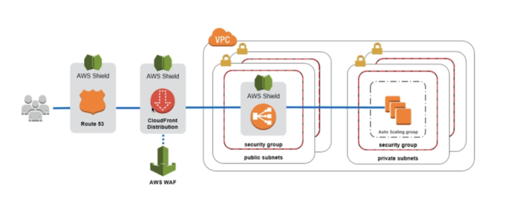

# **Web Application Firewall (WAF).**

* Protects web applications from common web exploits (layer 7).
* Layer 7 is HTTP (vs layer 4 being TCP).
* WAF can be deployed on an Application Load Balancer, API Gateway & CloudFront.
* To use WAF:
    * Need to define a Web ACL (Web Access Control List). Rules can include:
        * IP addresses, HTTP headers, HTTP body, URI strings.
        * Protects from common attacks such as SQL-injections & Cross-Site Scripting (XSS).
        * Size restraints, geo-match (block countries).
        * Rate-based rules (to count occurences of events) - for DDoS protection.

## **Firewall Manager.**

* Manage rules in all accounts of an AWS organisation.
* Common set of security rules.
* WAF rules (ALB, API Gateway, CloudFront).
* Shield advanced (ALB, CLB, Elastic IP, CloudFront).
* Security groups for EC2 & ENI resources in your VPC.

## **Architecture for DDoS protection.**

