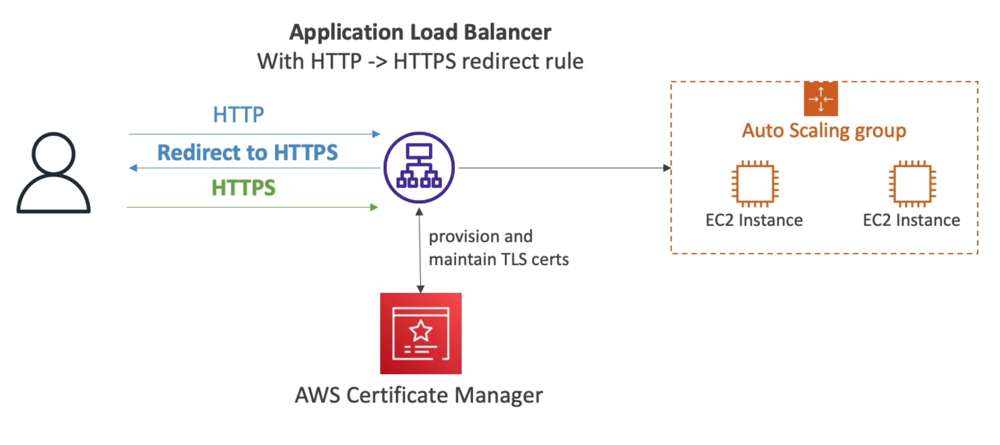

# **Certificate Manager (ACM).**

* Easily provision, manage & deploy TLS / SSL certificates.
* Provide in-flight encryption for websites (HTTPS).
* Supports both public & private TLS certificates.
* Free of charge for public TLS certificates.
* Automatic TLS certificate renewal.
* Integrations with:
    * Elastic Load Balancers.
    * CloudFront distributions.
    * APIs on API gateway.
* Cannot use ACM with EC2.

## **Requesting Public Certificates.**

1). List domain names to be included in the certificate: \
* Fully qualified domain name... corp.example.com
* Wildcard domain names... \*.example.com 

2). Select validation method - DNS validation or Email validation. \
* DNS validation is preferred for automation purposes.
* Email validation will send emails to contact addresses.
* DNS validation will leverage a CNAME record to DNS config (e.g. Route53).

3). It will take a few hours to get verified.

4). The public certificate will be enrolled for automatic renewal. \
* ACM automatically renews ACM-generated certificates 60 days before expiry.

## **Importing Public Certificates.**

* Option to generate the certificate outside of ACM & then import it.
* No automatic renewal, must import a new certificate before expiry.
* ACM sends daily expiration events starting 45 days prior to expiration:
    * The # of days can be configured.
    * Events appear in EventBridge.
    * These can be used to trigger external resources (Lambda, SNS, etc...).
* AWS Config has a managed rule named "acm-certificate-expiration-check" to check for expiration certificates (configurable number of days).

## **Integration with ALB.**

## **API Gateway - Integration.**

* Create a Custom Domain Name in API Gateway.
* Edge-Optimised (default) - for global clients:
    * Requests are routed through the CloudFront Edge locations (improves latency).
    * The API Gateway still lives in only one region.
    * **The TLS Certificate must be in the same region as CloudFront (in us-east-1)**.
    * Then setup a CNAME or (better) an Alias record in Route 53.
* Regional:
    * For clients within the same region.
    * Could manually combine with CloudFront (more control over the caching strategies & the distribution).
    * **TLS Certificate must be imported on API Gateway, in the same region as the API Stage**.
    * Then setup a CNAME or (better) an Alias record in Route 53.
* Private:
    * Can only be accessed from your VPC using an interface VPC endpoint (ENI).
    * Use a resource policy to define access.