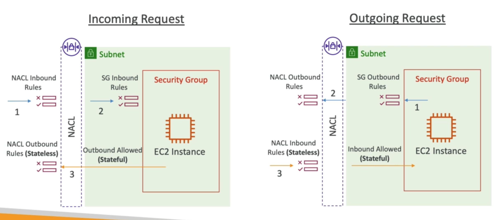
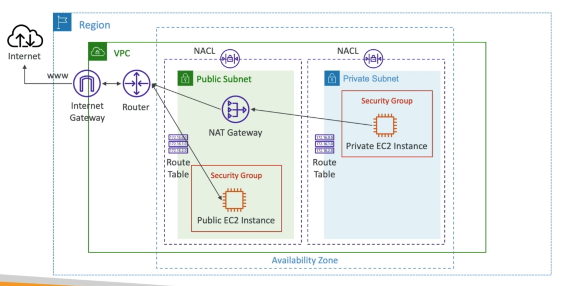
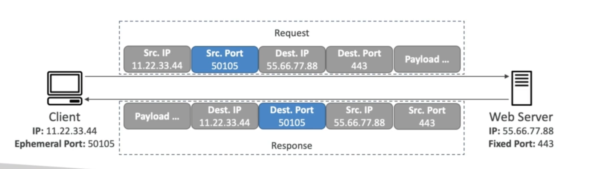
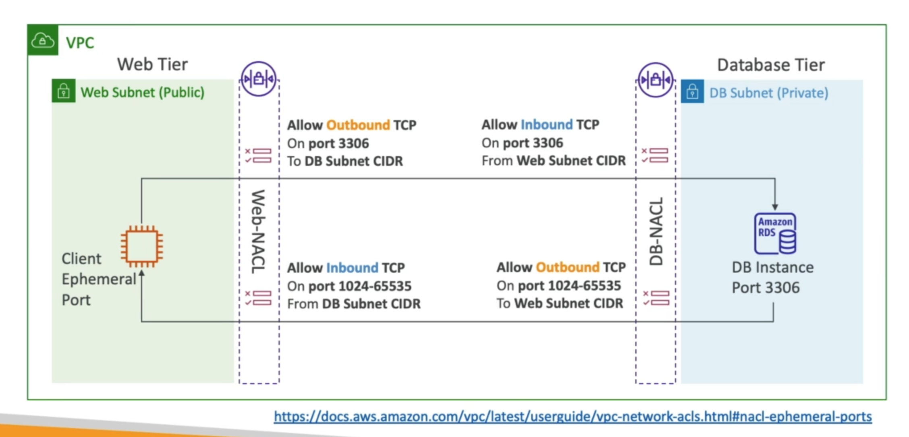

# **Security Groups & NACLs.**

## **Security Groups vs NACLs.**

* NACLs = Network Access Control List.

| Security Groups  | NACLs  |
|---|---|
| Operate at the instance level.  | Operate at the subnet level.  |
| Support allow rules only.  | Support allow & deny rules.  |
| **Stateful** - return traffic is automatically allowed, regardless of rules.  | **Stateless** - return traffic must be explicitly allowed by rules (ephemeral ports).  |
| All rules evaluated before a decision is made.  | Rules are evaluated in order of precedence.  |
| Applies to an EC2 instance when specified by someone.  | Automatically applies to all EC2 instances in the subnet it's assocated with.  |

## **Network Access Control Lists (NACLs).**

* NACLs are like firewalls, which control traffic from & to subnets.
* One NACL per subnet, new subnets are assigned to the default NACL.
* You define NACL rules:
    * Rules have a number (1-32766), higher precedence with a lower number.
    * First rule match will drive the decision.
    * AWS recommends adding rules in increments of 100.
    * Example - if you define rule #100 ALLOW 10.0.0.10/32 & rule #200 DENY 10.0.0.10/32, then the IP address will be allowed because rule 100 has a higher precedence than rule #200.
    * The last rule is an asterisk (*) & denies a request in case of no rule match.
* Newly created NACLs will deny everything.
* NACL are a great way to block a specific IP address at the subnet level.

## **Default NACL.**

* Accepts everything inbound / outbound with the subnets it's associated with.
* Do NOT modify the default NACL, instead create custom NACLs.

## **Ephemeral Ports.**

* For any two endpoints to establish a connection, they must use ports.
* Clients connect to a defined port & expect a response on an ephemeral port.
* Different operating systems use different port ranges:
    * IANA & MS Windows 10 -> 49152 - 65535.
    * Many linux kernels -> 32768 - 60999.

## **NACL with Ephemeral Ports.**

