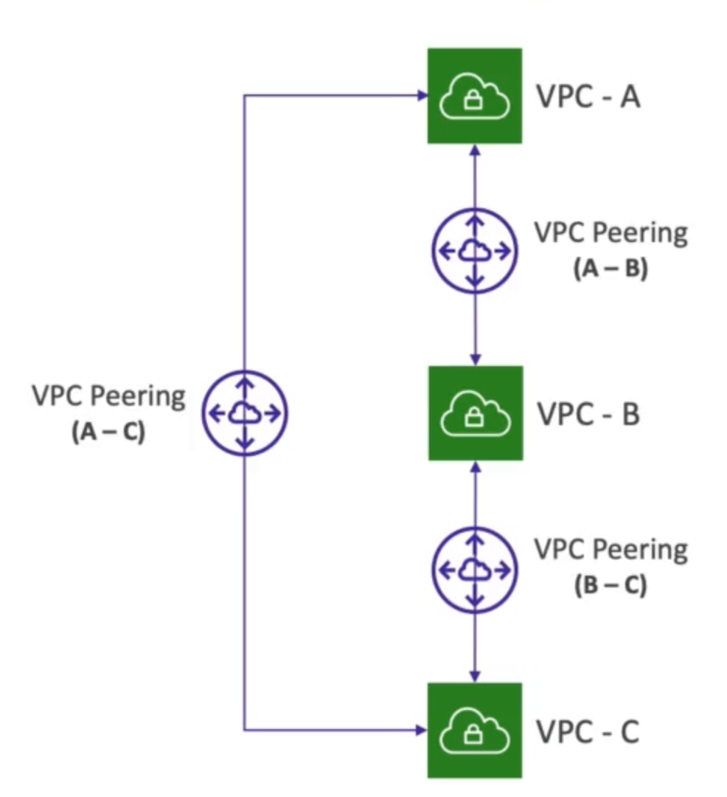

# **VPC Peering.**

* Privately connect two VPCs using AWS' network.
* Make them behave as though they were in the same network.
* Must not have overlapping CIDRs.
* VPC peering connection is **NOT transitive** (must be established for each VPC that need to communicate with one another).
* You must update route tables in each VPC subnet to ensure EC2 instances can communicate with one-another.

## **Good to Knows...**

* You can create VPC peering connections between VPCs in different accounts & regions.
* You can reference a security group in a peered VPC (works cross accounts, but must be the same region).