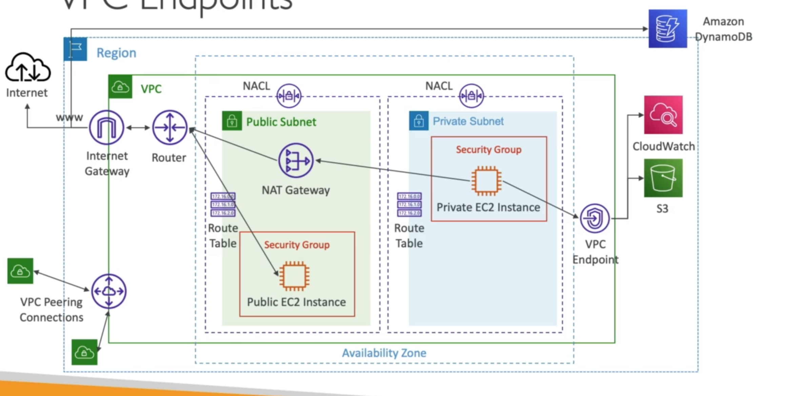

# **VPC Endpoints.**

* These are powered by a service called AWS PrivateLink.
* This allows private communication between your applications / EC2 instances inside your private subnets & other AWS services in your account.
* Prevents communication over the public internet.
* Every AWS service is publicly exposed via a URL.
* They're redundant & scale horizontally.
* They remove the need of IGW, NATGW,... to access AWS services.
* In case of issues:
    * Check DNS setting resolution in your VPC.
    * Check your route tables.

## **Different Types of Endpoint.**

* Interface Endpoints:
    * Provisions an ENI (a private IP address) as an entry point (must attach a security group).
    * Supports most AWS services.
* Gateway Endpoints:
    * Provisions a gateway & must be used as a target in a route table.
    * These only support S3 & DynamoDB.