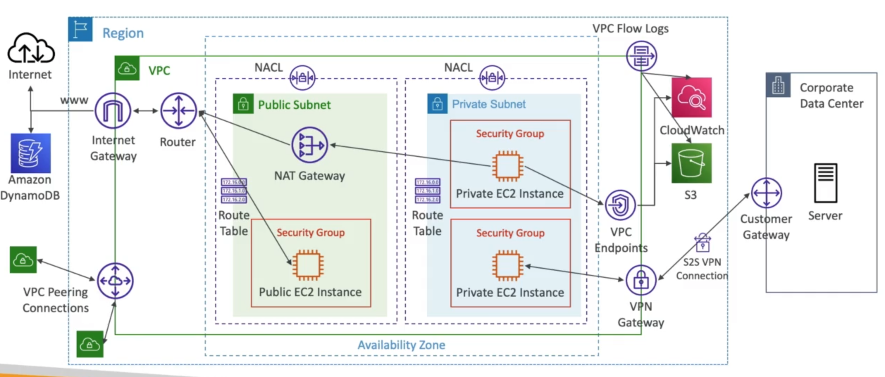
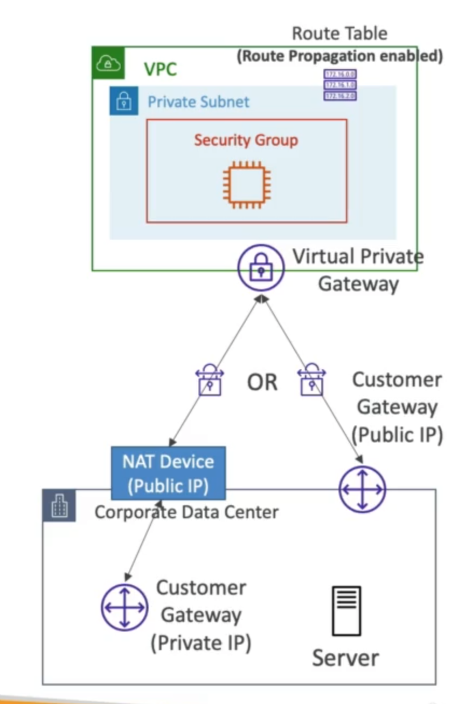
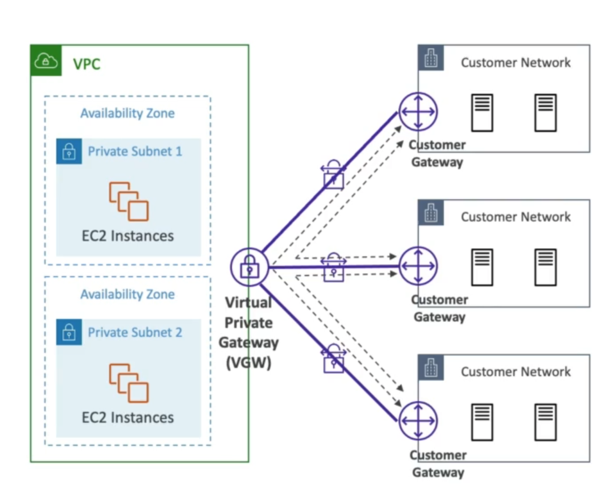

# **Site-to-Site VPN.**

Site-to-Site VPN connectivity needs two things:

* Virtual Private Gateway (VGW):
    * VPN concentrator on the AWS side of the VPN connection.
    * VGW is created & attached to the VPC from which you want to create the Site-to-Site VPN connection.
    * Possibility to customise the ASN (Autonomous System Number).
* Customer Gateway (CGW):
    * Software application or physical device on the customer side of the VPN connection.

## **Establishing a Connection.**

* Customer Gateway Device (on-premise):
    * Public IP - public Internet-routable IP address for you CGW.
    * Private IP - if it's behind a NAT device that's enabled for NAT-traversal (NAT-T), use the public IP address of the NAT device.
    * **Enable Route Propagation for the VGW in the route table that is associated with your subnets.\***
    * If you need to ping your EC2 instances from on-premises, make sure you add the ICMP protocol on the inbound of your security groups.

## **VPN CloudHub.**

* Provides secure communication between multiple sites, if you have multiple VPN connections.
* Low cost hub-and-spoke model for primary or secondary network connectivity between different locations (VPN only).
* It's a VPN connection that goes over the public internet (but is still encrypted).
* To set it up, connect multiple VPN connections on the same VGW, setup dynamic routing & configure route tables.

