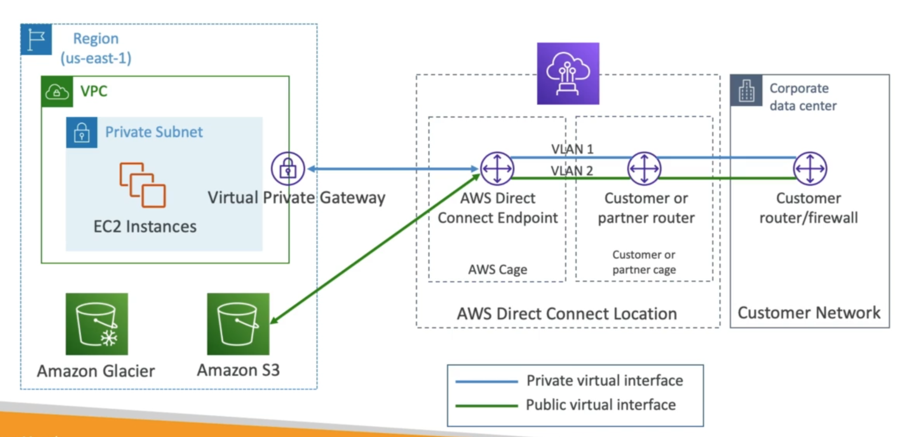
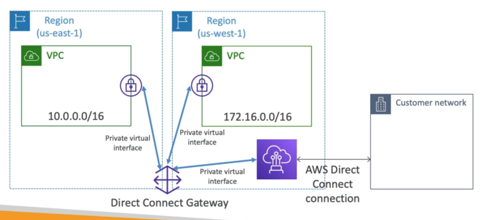
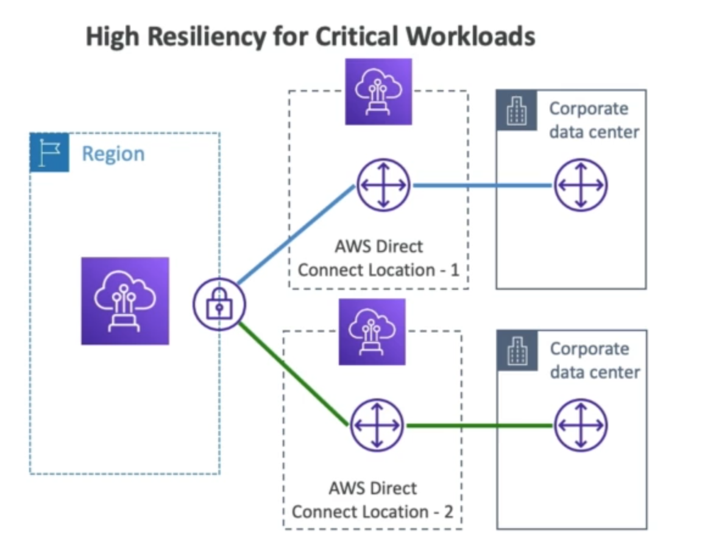
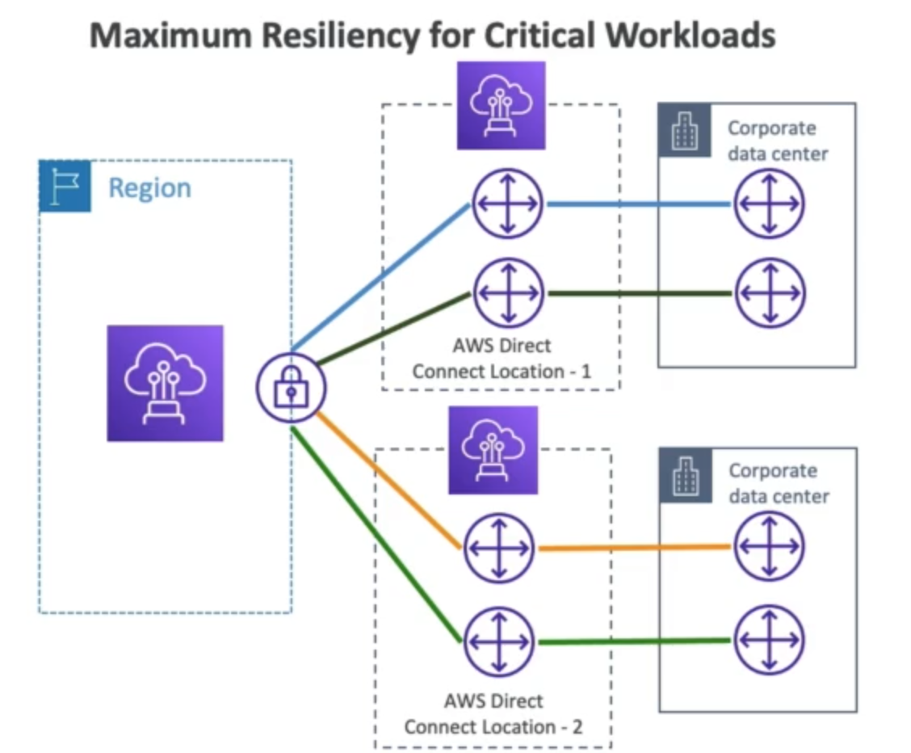
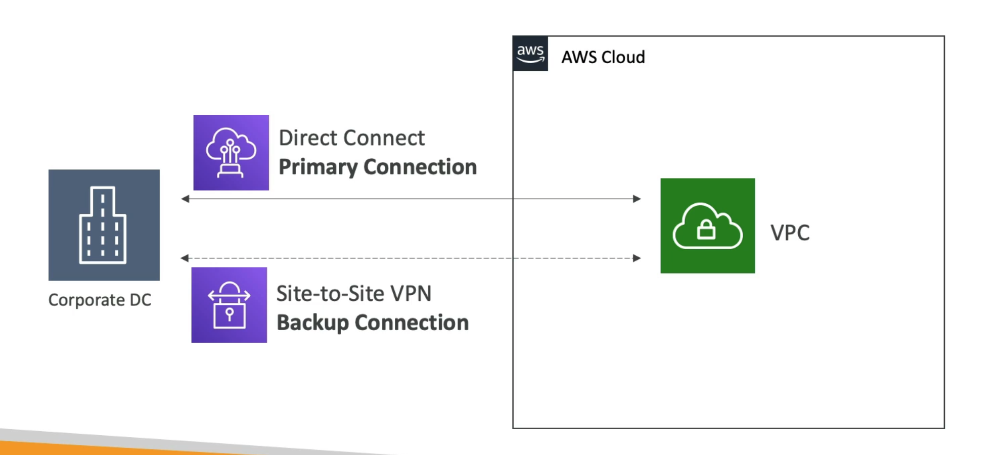

# **Direct Connect (DX).**

* Provides a dedicated private connection from a remote network to your VPC.
* Dedicated connection must be setup between your Direct Connect & Direct Connect locations.
* You need to setup a Virtual Private Gateway on your VPC.
* Access public resources (S3) & private (EC2) on same connection.
* Use Cases:
    * Increase bandwidth throughput - working with large data sets - lower cost.
    * More consistent network experience - applications using real-time data feeds.
    * Hybrid environments (on prem + cloud).
* Supports both IPv4 & IPv6.

## **Direct Connect Gateway.**

* If you want to setup a Direct Connect to one or more VPC in many different regions (in the same account), you must use a Direct Connect Gateway.

## **Connection Types.**

* Dedicated Connections - 1 Gbps & 10 Gbps capacity:
    * Physical ethernet port dedicated to the customer.
    * Request is made to AWS first, then completed by AWS Direct Connect Partners.
* Hosted Connections - 50 Mbps, 500 Mbps, 10 Gbps:
    * Connection requests are made via AWS Direct Connect Partners.
    * Capacity can be added or removed on demand.
    * 1, 2, 5, 10 Gbps available at select AWS Direct Connect Partners.
* **Lead times are often longer than 1 month to establish a new connection.**

## **Encryption.**

* Data in transit is not encrypted but is private.
* AWS Direct Connect + VPN provides an IPsec-encrypted private connection.
* Good for an extra level of security, but slightly more complex to put in place.

## **Resiliency.**

* High Resiliency for Critical Workloads:
    * One connection at multiple locations.

* Maximum Resiliency for Critical Workloads:
    * Two connections at multiple locations.
    * Max Resiliency is achieved by separate connections terminating on separate devices in more than one location.

# **Site-to-Site VPN connection as backup.**

* In case Direct Connect fails, you can set up a backup Direct Connect connection (which is expensive) or you can set up a Site-to-Site VPN connection as a backup.

