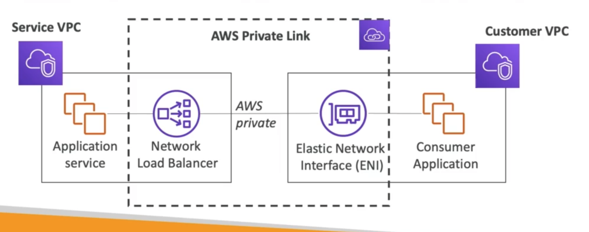
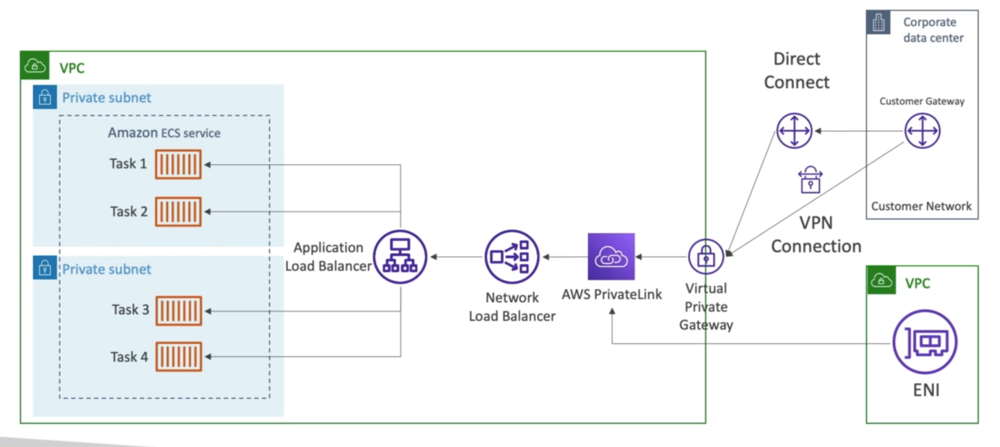

# **PrivateLink.**

If we want to expose services in our VPC to other VPC's, we have 2 options:

1). Make the resource public:

* Goes through the internet.
* Tough to manage access.

2). VPC Peering:

* Must create many peering solutions.
* Opens the entire network (not just one resource).

3). PrivateLink:

* Most secure & scalable way to expose a service to thousands of VPC's.
* Does not require VPC peering, IGW, NAT, route tables...
* Requires a Network Load Balancer (Service VPC) & ENI (Customer VPC) or Gateway Load Balancer.
* If the NLB is in multiple AZ's, & the ENI is also in multiple AZ's, the solution is fault tolerant.

## **PrivateLink & ECS.**

