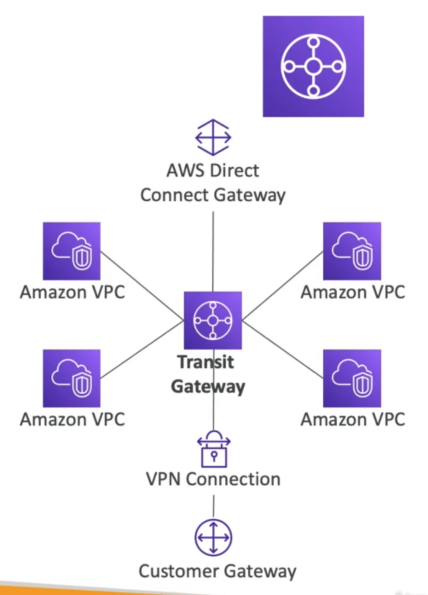
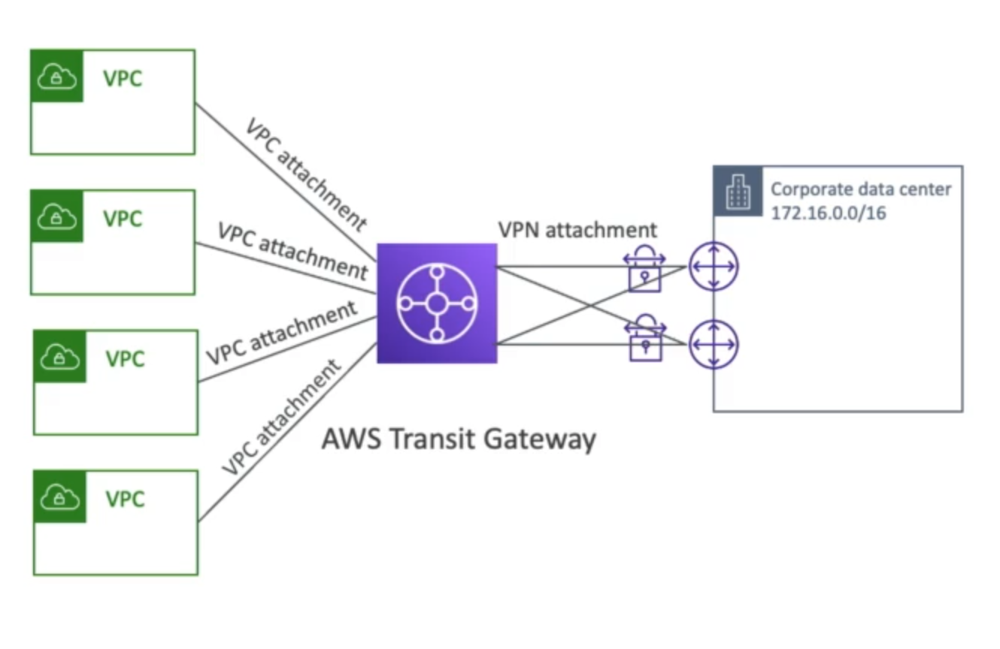
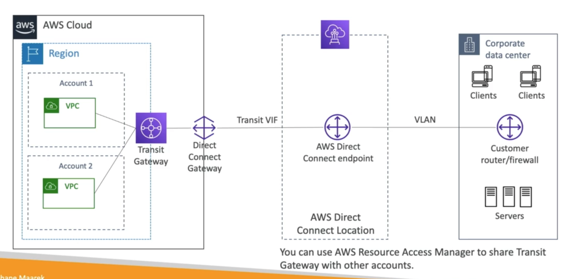

# **Transit Gateway.**

* For having transitive peering between thousands of VPC & on-premises, hub-and-spoke (star) connections.
* It is a regional resource that can work cross-region.
* Share cross-account using the Resource Access Manager.
* You can peer Transit Gateways across regions.
* Route Tables - limit which VPC can talk to other VPC's.
* Works with Direct Connect Gateway, VPN connections.
* Supports IP Multicast (not supported by any other AWS service).

## Site-to-Site VPN ECMP.**

* ECMP = Equal-cost multi-path routing.
* Routing strategy to allow forwarding a packet over multiple best path.
* Use case:
    * Create multiple Site-to-Site VPN connections to increase the bandwidth of your AWS connection.

## **Share Direct Connect between Multiple Accounts.**

