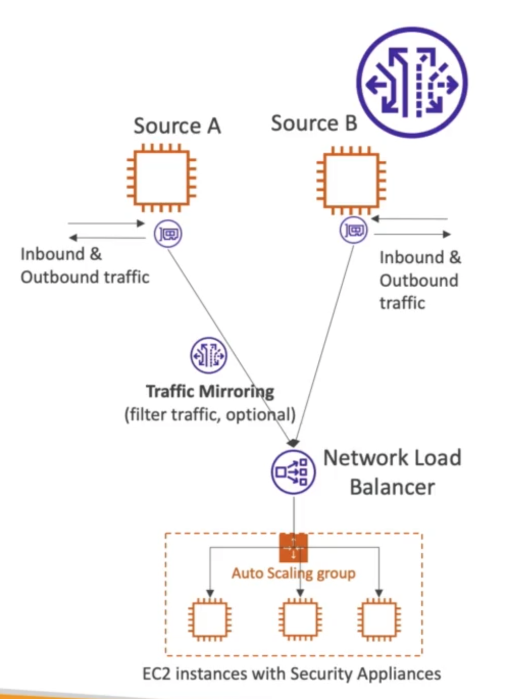

# **VPC Traffic Mirroring.**

* Allows you to capture & inspect network traffic inside your VPC.
* Route the traffic to security appliances that we manage.
* Capture traffic:
    * From (Source) - ENIs.
    * To (Targets) - an ENI or Network Load Balancer.
* Capture all packets or capture the packets of your interest.
* Source & Target can either be in the same VPC or different if you are using VPC Peering.
* Use cases:
    * Content inspection.
    * Threat monitoring.
    * Troubleshooting.

