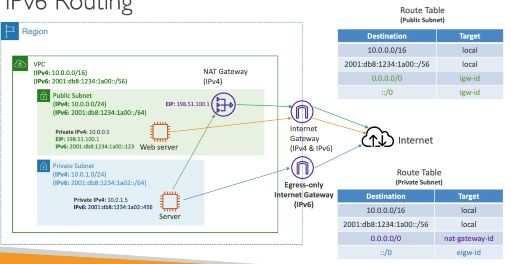

# **Egress-Only Internet Gateway.**

* Used for IPv6 only.
* Similar to a NAT Gateway but for IPv6.
* Allows instances in your VPC outbound connections over IPv6 while preventing the internet to initiate an IPv6 connection to your instances.
* Must update the route tables.

## **IPv6 Routing.**

