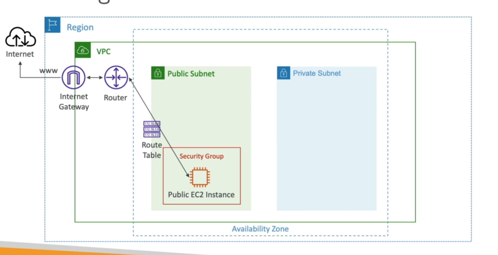

# **Internet Gateway (IGW).**

* Allows resources (e.g. EC2 instances) in a VPC to connect to the internet.
* It scales horizontally & is highly available & redundant.
* Must be created separately from a VPC.
* One VPC can only be attached to one IGW & vice versa.
* Internet gateways on their own do not allow internet access.
* Route tables must also be edited.

