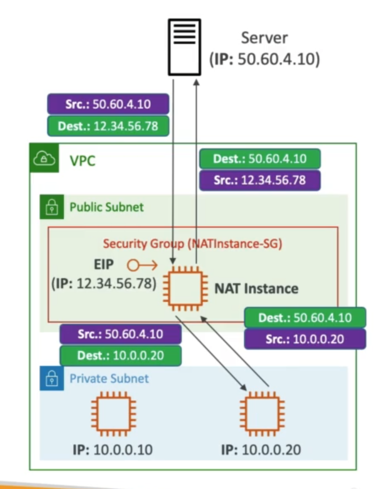
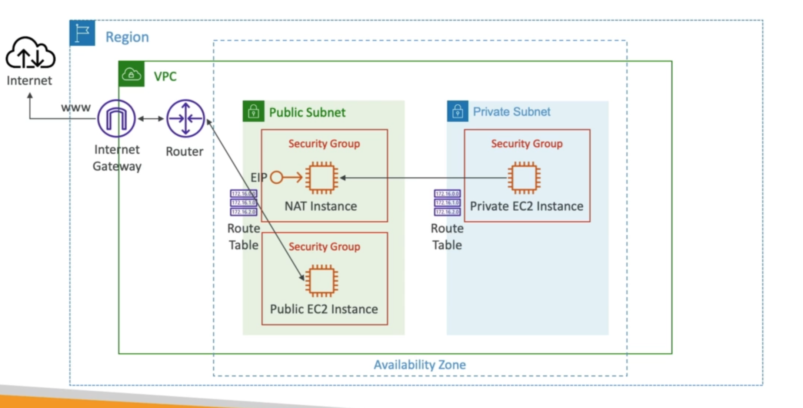

# **NAT Instances.**

_These are outdated, but are still present in the exam._

* NAT = Network Address Translation.
* Allows EC2 instances in private subnets to connect to the internet.
* Must be launched in a public subnet.
* Must disable EC2 setting - Source / Destination Check.
* Must have an Elastic IP attached to it.
* Route tables must be configured to route traffic from private subnets to the NAT instance.

## **NAT Instance Comments.**

* Pre-configured Amazon Linux AMI is available.
    * Reached the end of standard support in 2021.
* Not highly available / resilient setup out of the box.
    * You need to create an ASG in multi-AZ & a resilient user-data script.
* Internet traffic bandwidth depends on EC2 instance type.
* You must manage security groups & rules:
    * Inbound:
        * Allow HTTP / HTTPS traffic coming from private subnets.
        * Allow SSH from your home network (access is provided through Internet Gateways).
    * Outbound:
        * Allow HTTP / HTTPS traffic to the internet.

