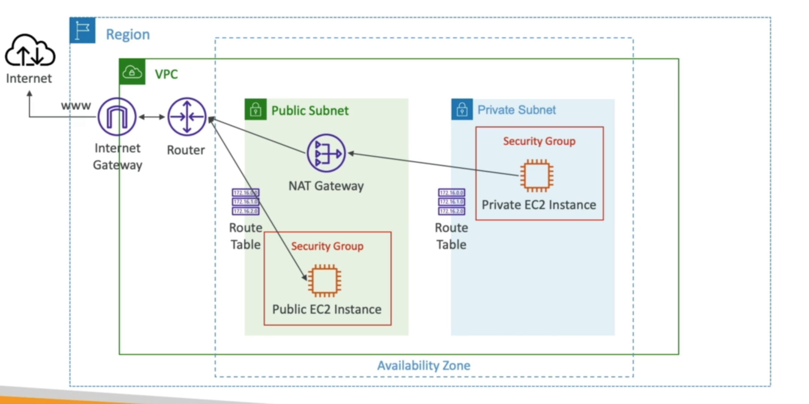

# **NAT Gateway.**

* AWS managed NAT instances, higher bandwidth, high availability, no admin.
* Pay per hour for usage & bandwidth.
* NATGW is created in a specific AZ, uses an Elastic IP.
* Can't be used by EC2 instances in the same subnet (only from other subnets).
* Requires an Internet Gateway (Private Subnet -> NATGW -> IGW).
* 5 Gbps of bandwidth with automatic scaling up to 5 Gbps.
* No security groups to manage or are required.

## **High Availability.**

* NAT Gateway is resilient within a single AZ.
* Must create NAT Gateways in multiple AZ for fault-tolerance.
* There is no cross-AZ failover needed because if an AZ goes down it doesn't need NAT.

