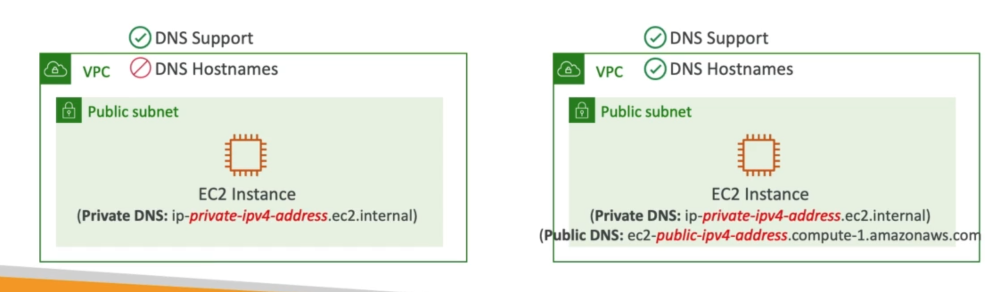

# **DNS Resolution.**

* DNS Resolution (enableDnsSupport):
    * Decides if DNS resolution from Route 53 Resolver server is supported for the VPC.
    * True (default) - it queries the Amazon Provider SNS Server at 169.254.169.253 or the reserved IP address at the base of the VPC IPv4 network range plus two (.2).

* DNS Hostnames (enableDnsHostnames):
    * By default:
        * True -> default VPC.
        * False -> newly created VPC's.
    * Won't do anything unless enableDnsSupport=true.
    * If true, assings public hostname to EC2 instance if it has a public IPv4.

* If you use a custom DNS domain name in a private hosted zone in Route 53, you must set both these attributes to true.

