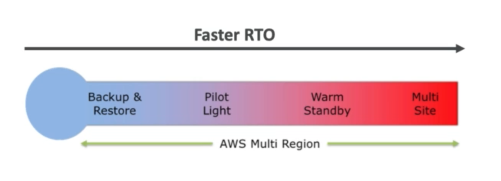
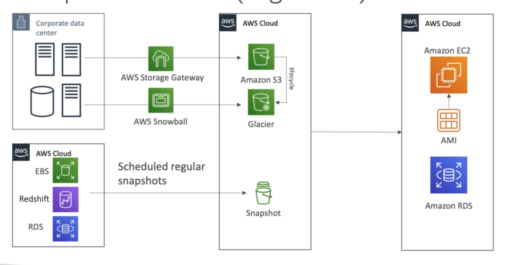
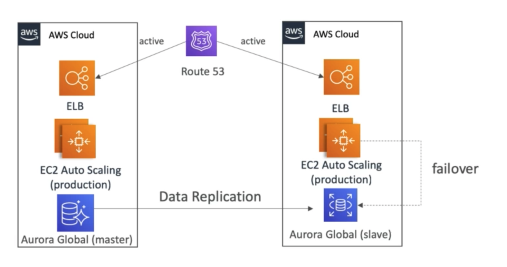

# **Disaster Recovery.**

* Any event that has a negative impact on the company's business continuity or finances is called a disaster.
* Disaster Recovery (DR) is about preparing for & recovering from a disaster.
* On-premise DR - traditional, very expensive.
* On-premise - hybrid recovery using the cloud.
* Cloud replication across different regions.
* **Two important terms:**
    * RPO - Recovery Point Objective.
    * RTO - Recovery Time Objective.

## **RPO & RTO.**

* RPO - How frequently do you backup data & how much data has been lost since the last backup.
* RTO - How quickly do you restore or recover from a disaster occurring.

## **Disaster Recovery Strategies.**

There are 4 main disaster recovery strategies to cover:

* Backup & Restore.
* Pilot Light.
* Warm Standby.
* Hot Site / Multi Site Approach.

### **Backup & Restore (High RPO).**

### **Pilot Light.**

* A small version of an application is always running in the cloud.
* Useful for the critical core (or pilot light) of the application.
* Very similar to Backup & Restore.
* Faster Backup & Restore as critical systems are already up.

### **Warm Standby.**

* Full system is up & running, but at minimum size.
* Upon disaster, we can scale the production load.

### **Multi-Site / Hot-Site Approach.**

* Very low RTO (minutes or seconds) - very expensive.
* Full production scale is running on AWS & on-premise.

### **All AWS Multi Region.**

## **Disaster Recovery Tips.**

* Backup:
    * EBS snapshots, RDS automated backups, snapshots, etc...
    * Regular pushes to S3 / S3 IA / Glacier, lifecycle policies, cross-region replication.
    * From on-premise -> Snowball or Storage Gateway.
* High Availability:
    * Route53 to migrate DNS over from region to region.
    * RDS Multi-AZ, ElastiCache, Multi-AZ, EFS, S3.
    * Site-to-Site VPN as a recovery from Direct Connect.
* Replication:
    * RDS Replication (cross-region), Aurora + global databases.
    * Database replication from on-premise to RDS.
    * Storage Gateway.
* Automation:
    * CloudFormation / Elastic Beanstalk to re-create a whole new environment.
    * Recover / reboot EC2 instances with CloudWatch if alarms fail.
* Chaos:
    * Netflix has a "simian-army" rendomly terminating EC2 servers.