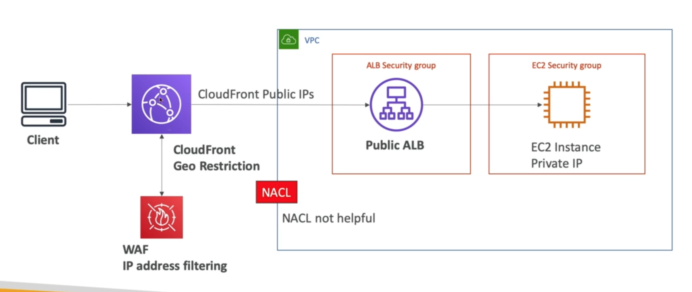

# **Blocking an IP Address.**

* We can install a WAF service with IP filtering on top of an application load balancer for enhanced security.
* However, if we use CloudFront, we can also install a WAF service with IP filtering on-top of that, this will add even more protection & security to our architecture.

