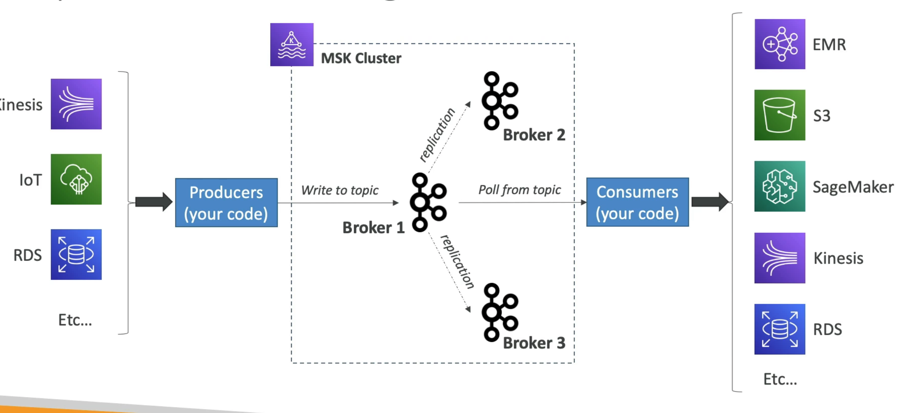

# **MSK - Managed Streaming for Apache Kafka.**

* Alternative to Kinesis.
* Fully managed Apache Kafka on AWS:
    * Allow you to create, update & delete clusters.
    * MSK creates & manages Kafka broker nodes & zookeeper nodes for you.
    * Deploy MSK cluster in your VPC, multi-AZ (up to 3 for high-availability).
    * Automatic recovery from common Kafka failures.
    * Data is stored on EBS volumes for as long as you want.
* MSK Serverless:
    * Run Apache Kafka on MSK without managing the capacity.
    * MSK automatically provisions resources & scales compute & storage.

## **Kinesis Data Streams vs MSK.**

* Kinesis Data Streams:
    * 1 MB message limit.
    * Data streams with Shards.
    * Shard splitting & merging.
    * TLS in-flight encryption.
    * KMS at-rest encryption.
* MSK:
    * 1 MB default, configure for higher (up to 10 MB).
    * Kafka topics with partitions.
    * Can only add partitions to a topic.
    * PLAINTEXT or TLS in-flight encryption.
    * KMS at-rest encryption.