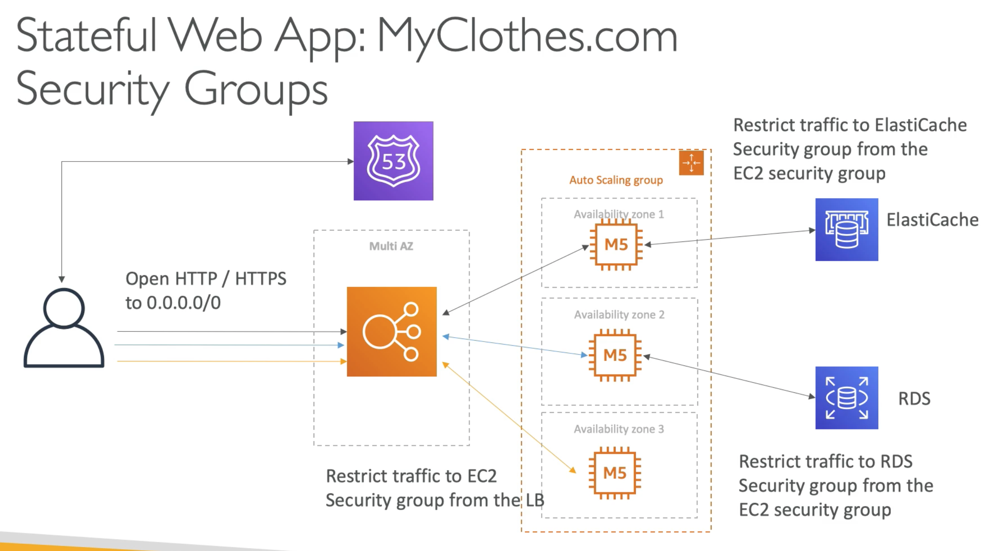

# **Introduction.**

We want to build a stateful web application, named "MyClothes.com". Here is a bit of background on what we'll want it to do:

* Allow people to buy clothes online.
* There will be a shopping cart with a checkout.
* Our website is having hundreds of users at the same time.
* We need to be able to scale horizontally and keep our web application as stateless as possible.
* Thus, users should not lose their shopping cart.
* Users could also have things like their customer details (address etc.) stored in a database.

## **Architecture.**

Let's follow on from our architecture from the previous use case ("WhatIsTheTime.com"), this included:

* Route 53 to act as a public hosted zone that clients can use to access our application.
* An elastic load balancer that will balance load across multiple AZ's.
* An auto scaling group that will allow our application to scale our instances to cope with demand without clients experiencing downtime.
* EC2 instances that will run our application.

We can indentify a potential pain point here, if a customer adds items to their shopping cart & is then re-directed to another instance shortly there-after, the customer will lose their cart.

## **Affinity.**

Let's introduce ELB stickiness / affinity to our architecture, this way, the customer will retain their session for a period of time that we can define. However, the client can still lose their shopping cart if the instance fails in-between requests.

## **User Cookies.**

Let's take a different approach, let's introduce user cookies as opposed to session affinity.

* Here, the user will send their shopping cart content as part of the request through user cookies.
* Now, no matter which EC2 instance the user gets re-directed to as part of their request, they will retain their shopping cart. This provides us with session affinity and high availability for the user.
* Our architecture is now described as ***stateless***, as our EC2 resources will be informed of prior actions by the user.
* However, the HTTP requests are getting **heavier** due to the cookies.
* There is also a bit of a security risk as cookies can be altered (to get around this we can enable our EC2 instances to validate the cookies).

## **Server Session.**

Let's explore a different approach, server session. Rather than the client sending the entirety of their cart in cookies, the client can include a "session_id" as part of the cookies included in their request, this can then be restored on whichever instance they get redirected to.

***Important to stress, that clients won't usually be aware they are submitting cookies as part of any request unless they specifically opt out.***

In the background, we might have an ElastiCache cluster. For clients, once their request hits an EC2 instance, we might want to write the contents of their cart to ElastiCache. Thus, when we have a second request into a different EC2 instance, we can use the session_id to retrieve our cart information from ElastiCache (an alternative could be DynamoDB - which we haven't used yet but are aware of what it is and how it works).

## **RDS.**

Let's assume we want to store some of the customers information, let's use their address as an example. To do this, we may want to introduce RDS (Aurora / Postgres / My SQL etc.) to our solution.

This gives us long-term storage capabilities that our application can read / write to when required.

As our website grows in popularity, we notice that a lot of customers are browsing different items or products, thus, we need to increase the amount of read capability on our site.

Let's introduce an RDS master to handle write requests, and multiple RDS replicas to handle read requests.

## **Write Through - RDS Alternative.**

If an EC2 instance tries to hit ElastiCache and cannot find the cached information, it will instead read/write from RDS and store information in the ElastiCache itself. Thus, when a request hits another EC2 instance & the instance needs to query for the cached information, it will be present.

This will improve RDS performance but will add a lot of ElastiCache / application complexity.

## **Failover.**

Here, we should avoid failover as a result of disaster by introducting a multi-AZ load balancer (similar concept to how we tackled the same problem for EC2).

We can also replicate this approach for our RDS & ElastiCache service by having replicas on stand-by across different AZ's.

## **Increasing Security.**

Let's introduce some security groups and policies.

* We can open all HTTP/HTTPS traffic into our multi-AZ load balancer.
* We should look to restrict traffic into our EC2 instances so that traffic only coming from our load balancer is allowed.
* Similarly for ElastiCache and RDS, we should only allow traffic from our EC2 instances / application.

Let's have a look at our architecture in full.

