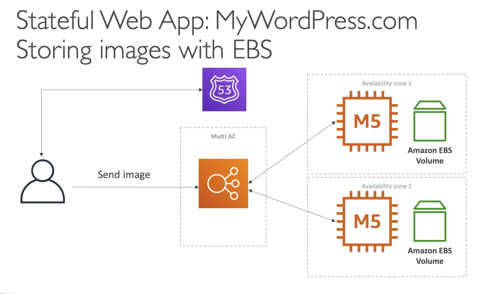
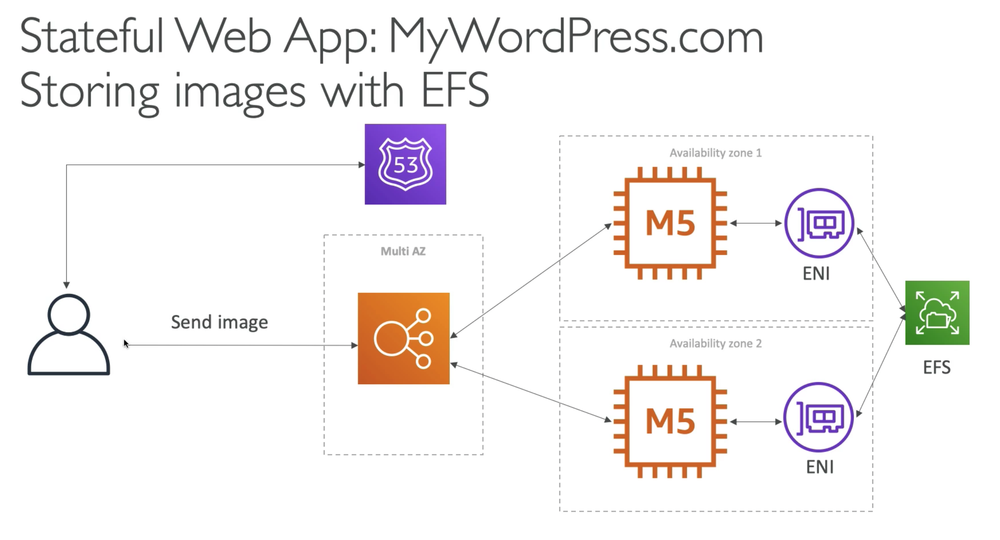

# **Introduction.**

* We are trying to create a fully scalable WordPress website.
* We want a website to access and correctly display picture uploads.
* Our user data and blog content should be stored somewhere in a MySQL database.
* We want global scaling.

## **RDS Layers.**

Let's pick up from the previous architecture we produced in section 9.3 for "MyClothes.com".

Let's now specify for the RDS instance that we want to use a MySQL Aurora database. This will drastically improve our scalability and availability.

## **EBS.**

Let's imagine a use case where a client or user wants to send an image into our application. We want our application to successfully receive, process and store the image for it to be displayed on the website.

We can attach an EBS volume to each of our EC2 instances hosting our application. However, if a client is directed through our load balancer to a specific instance and the image is stored on the EBS volume of that instance alone... you might be able to spot a glaring issue should the same client be re-directed to a different instance in the future.

The below architecture diagram illustrates the problem.

EBS volumes are extremely useful for single instance architecture. However, when you start scaling your application across multiple AZ's or regions, we start to see the problems of localised EBS volumes.

## **EFS.**

Instead of EBS volumes, let's use EFS. Here we can introduce a network file system that can share data across instances.

Now, all of our instances can access our EFS drives and we can share data across availability zones.

Here's our architecture.

