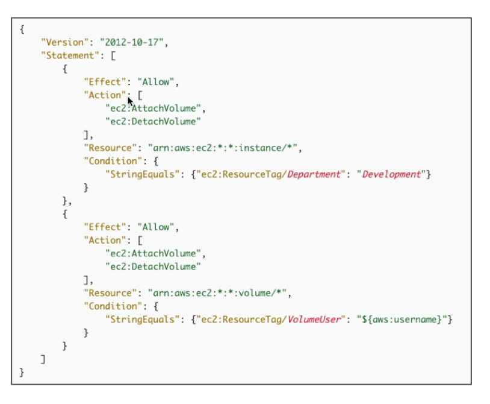
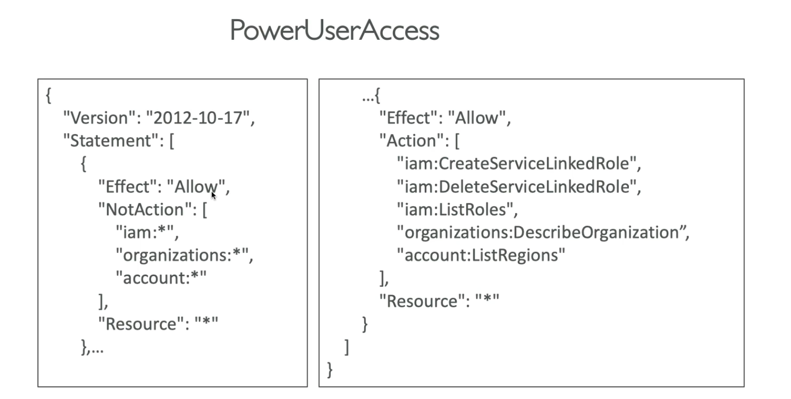
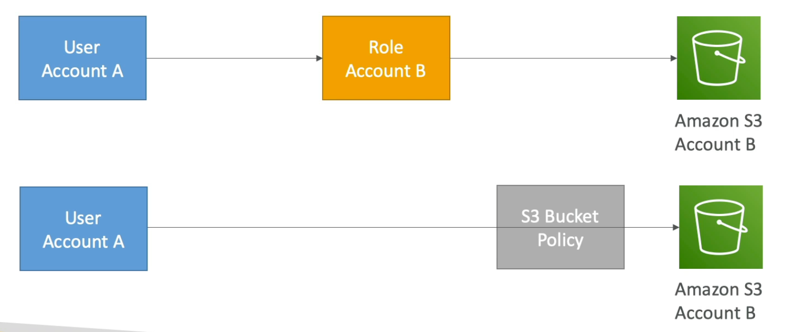

# **IAM Refresh.**

* Users - long term credentials for specific users.
* Groups - users can be assigned to with scoped permissions.
* Roles - short-term credentials that are invoked using STS.
    * EC2 instance roles - uses the EC2 metadata service, only allows for one role at a time per instance.
    * Service roles - used by services such as API Gateway, CodeDeploy, etc...
    * Cross account roles - used for accessing another account to perform actions in another account.
* Policies - define what a role or user can do.
    * AWS managed policies.
    * Customer managed policies (allows for versioning).
    * Inline policies - assigned to one specific user or role.
* Resource based policies (S3, SQS, etc...).

## **Deeper Dive.**

* The anatomy of an IAM policy looks something a little like the following:
    * JSON document.
    * Can contain different policy statements, for example:
        * Effect.
        * Action.
        * Resource.
        * Conditions.
        * Policy variables.

* Explicit DENY's take precedence over any explicit ALLOW's.
* Best practice is to use the principle of least privilege.
* Access Advisor can be used to assess when policies where last used & their associated permissions.
* Access Analyzer can be used to analyse resources that are shared with an external identity.
* You can use a combination of explicit allows in combination with the "NotAction" key to avoid having to specify explicit deny's, for example with the role below, if we used a DENY statement on the LHS, all the actions on the RHS would not have sufficient permissions - by using "NotAction" with "Allow" we can deny all actions except the ones we specify.

## **Policy Conditions.**

* IAM policy conditions consist of multiple components.
* Operators:
    * `String (StringEquals, StringNotEquals, StringLike, ...)`.
        * Usually followed by a condition, using key-value pairs.
        * `"Condition": {"StringEquals": {"aws:PrincipalTag/job-category": "iamuser-admin"}}`
    * `Numeric (NumericEquals, NumericNotEquals, NumericLessThan, ...)`.
    * `Date (DateEquals, DateNotEquals, DateLessThan, ...)`.
    * `Boolean (Bool)`.
    * `IpAddress`.
    * `ArnEquals, ArnLike`.
    * `Null`.
* Variables & tags:
    * Example - `${aws:username}`
        * `"Resource": ["arn:aws:s3:::mybucket/${aws:username}/*"]`
    * AWS Specific tags & variables.
    * AWS Service specific tags & variables.
    * Tag based resources.

## **Roles vs Resource Based Policies.**

* We can attach a policy to a resource (i.e. an S3 bucket) or we can use a role (with a specific policy attached to it) as a proxy.

* When you assume a role (a user, application or a service), **you give up your original permissions & take the permissions assigned to the role you have just assumed**.
* Using resource based policies, we gain additional policies on the resource we need.
* If you need to perform an action in your own AWS account but then perform another action in a different AWS account, we would always use resource based policies on top of our role based permissions in our original account.
* Resource policies are supported by most AWS resources.

## **Permission Boundaries.**

* IAM permission boundaries are supported for users & roles but not groups.
* This is an advanced feature that specifies the maximum set of permissions an IAM entity can acquire.
* The permissions boundary takes precedence over IAM policies.
* Use cases for permissions boundaries:
    * Delegate responsibilities to non administrators within their permission boundaries, for example to create new IAM users.
    * Allow developers to self-assign policies & manage their own permissions whilst ensuring that they don't escalate their privileges.
    * Restrict a specific user instead of an entire account.