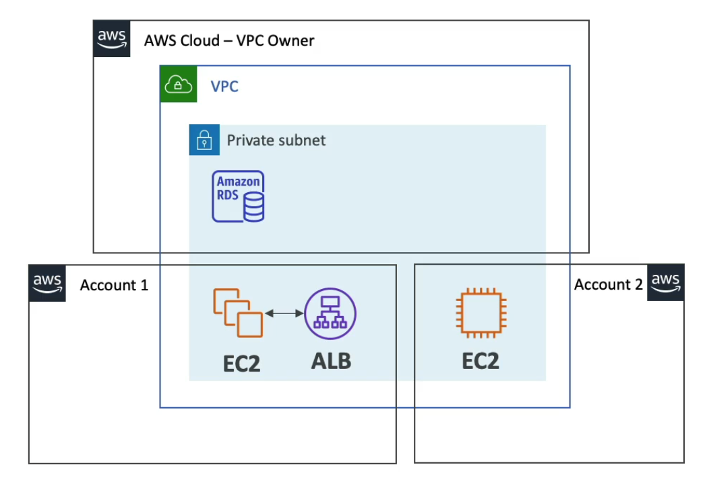
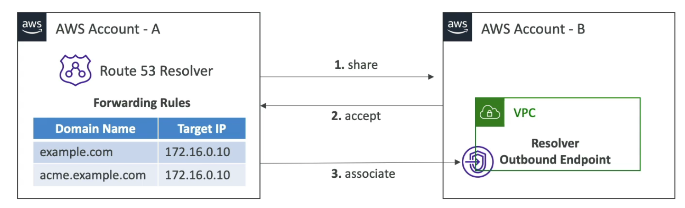

# **Resource Access Manager (RAM).**

* Share AWS resources that you own with other AWS accounts.
* Share with any account or within your organisation.
* Avoid any resource duplication.
* A very common example here is sharing of your VPC resources:
    * Allows you to have all resources launched in the same subnets.
    * Must be from the same AWS Organisation.
    * Cannot share security groups & default VPCs.
    * Participants can manage their own resources in there.
    * Participants can't view, modify, delete resources that belong to other participants or the owner.
* You can also share other resources such as:
    * Transit Gateways.
    * Route 53 (Resolver Rules, DNS Firewall Rule Groups).
    * License manager configurations.
    * Aurora DB clusters.
    * AWS Glue components.
    * EC2 components.
    * Network firewall policies.

## **VPC Example.**

* Each account is responsible for its' own resources.
* Each account cannot view, modify or delete any other resources in any other accounts even though they share the same VPC.
* Network is shared, meaning you get the following benefits:
    * Resources can communicate with each other easily.
    * Applications are accessed easily across accounts using their private IP addresses - this also means that we don't need to use something like VPC peering cross-account.
    * Security groups from other accounts can be referenced for maximum security.
* Use cases:
    * Applications with a high degree of interconnectivity.
    * Applications within the same trust boundaries.

## **Managed Prefix List.**

* A managed prefix list is a set of one or more CIDR blocks.
* Makes it easier to configure & maintain Security Groups & Route Tables.
* Once this prefix list is shared with another account via. AWS RAM, they can be referenced by Security Groups in the other account.
* Customer-Managed prefix list:
    * Set of CIDRs that you define & are managed by you.
    * Can be shared across an AWS Organisation.
    * You can then modify many security groups at once by modifying the prefix list (centralised management model).
* AWS-Managed prefix list:
    * Set of CIDRs for AWS services.
    * These can't be created, modified, shared or deleted.

## **Route 53 Outbound Resolver.**

* Helps you scale forwarding rules to your DNS in case you have multiple accounts & VPC.

