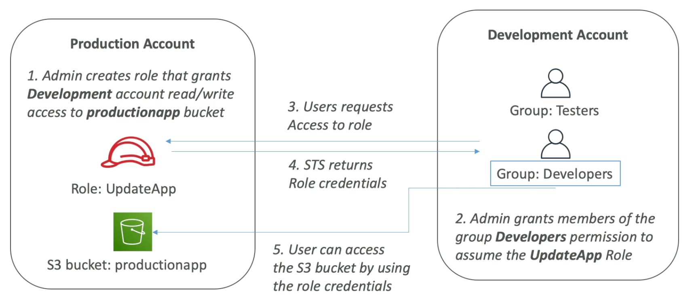
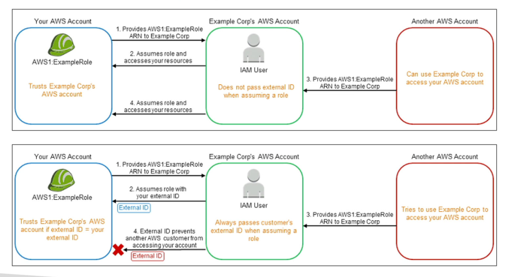
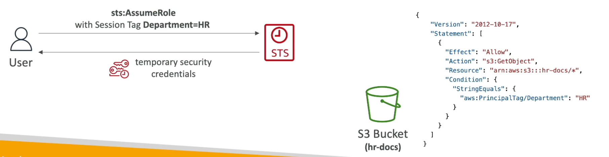

# **STS.**

* Firstly, define a role within your account.
* Define which principals can access this IAM role.
* Use AWS STS (Security Token Service) to retrieve credentials & impersonate the IAM role that you have access to.
* Temporary credentials can be valid between 15 minutes & 12 hours.
* This is useful for providing access for an IAM user in one AWS account that you own to access resources in another accounts or third-parties.
* This can also be used to provide access to your AWS services to other AWS services or resources.
* We can also use STS for externally authenticated users (identity federation).
* STS also has a feature in which you can revoke active sessions & credentials for a role (using a time statement).
* Remember - **when you assume a role, you give up your original permissions & take the permissions assigned to the role**.
* You can grant IAM user permissions to switch roles within your AWS account or to roles defined in other AWS accounts that you own - this can have the following benefits:
    * It forces users to switch to a specific role to perform a specific action (added layer of security).
    * You must explicitly grant the user permission to use any dangerous role.
    * You can protect the role with 2FA.
    * Least privilege + Cloudtrail auditing.

## **Cross-account STS.**

## **Third-parties & STS.**

* 3rd parties are defined as anything outside of our defined zone of trust.
* Access Analyzer can help scope this.
* In order to grant scoped access to 3rd parties, we need a few things:
    * The 3rd party AWS account ID.
    * An external ID / secret between yourself & the 3rd party which is user-defined.
        * This external ID must be provided when defining the trust policy & when assuming the role.
    * Define permissions in our IAM policy.

## **The Confused Deputy.**

* Following on from the above, we can see how an external ID prevents external security attacks:

## **Session Tags in STS.**

* You can also pass tags when you assume an IAM role or federate in STS.
* This is useful for in-line conditional policies:
    * `aws:PrincipalTag` condition:
    * Compares the tag attached to the principal making the request with the tag you specified in the policy.

## **Important APIs for STS.**

* `AssumeRole` - access a role within your account or cross-account.
* `AssumeRoleWithSAML` - return credentials for users logged in with SAML.
* `AssumeRoleWithWebIdentity` - return credentials for users logged in with an identity provider.
    * AWS recommends to not use this API & use Cognito instead.
* `GetSessionToken` - for multi-factor authentication, from a user or root user.
* `GetFederationToken` - used to obtain temporary credentials for a federated user, usually a proxy app that with give the credentials to a distributed app inside a corporate network.