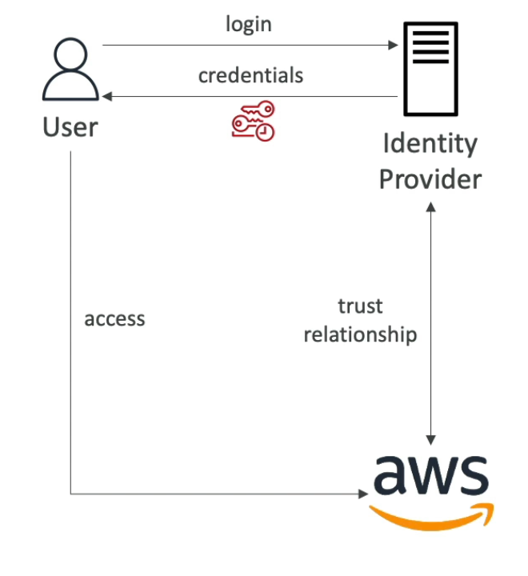
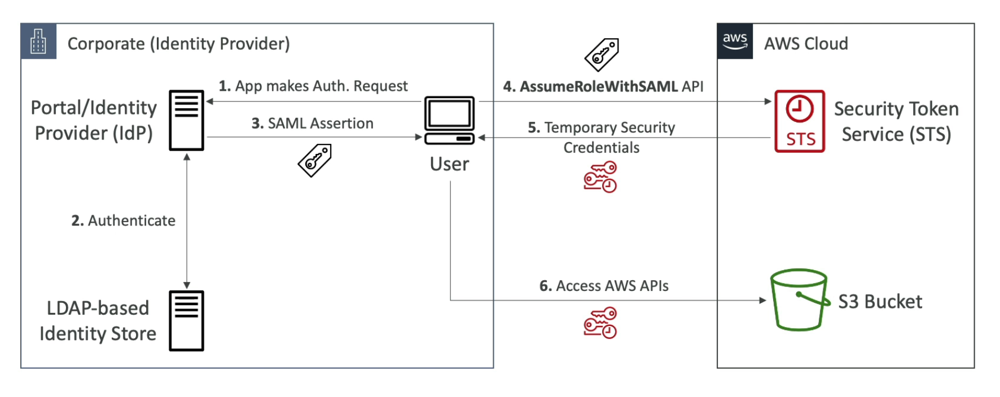
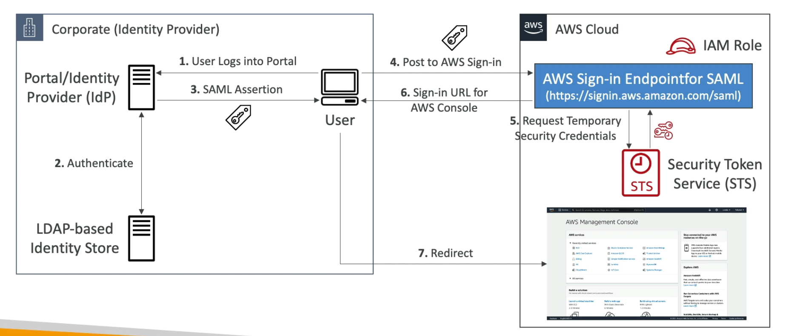
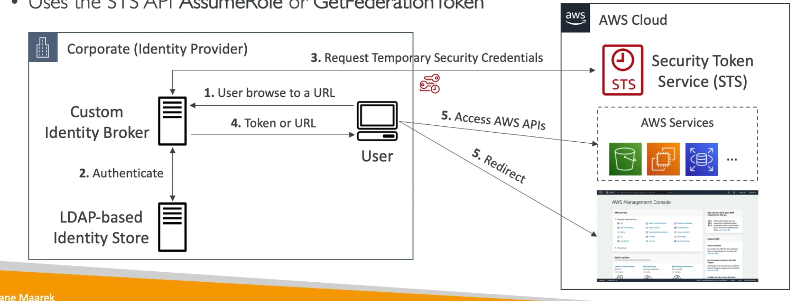
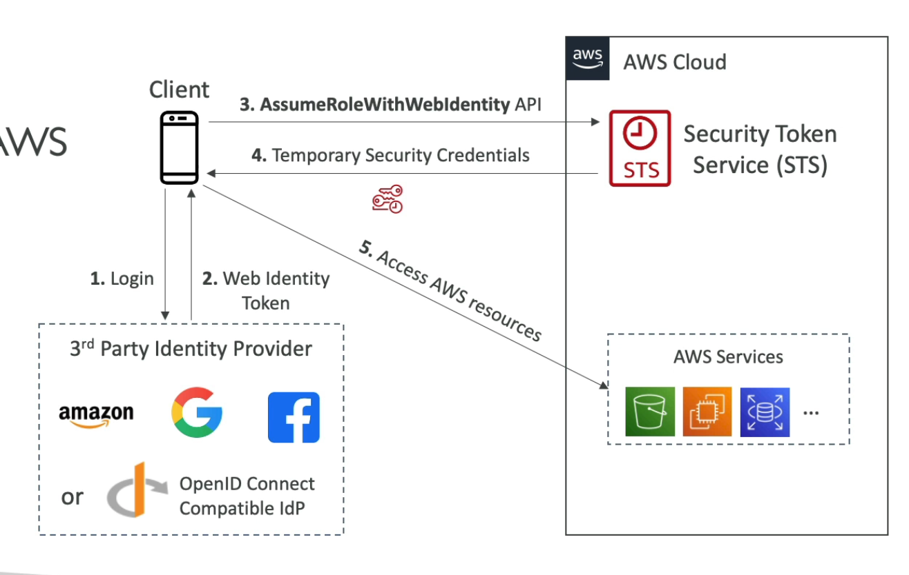
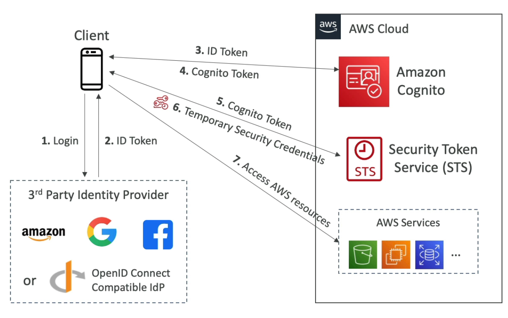

# **AWS Identity Federation.**

* Give users outside of AWS permissions to access AWS resources in your account.
* You don't want to create IAM users inside AWS.
* Use cases:
    * Integration with 3rd party identity management systems such as Active Directory.
    * Web or mobile applications that need access to AWS resources.
* Identity federation can have multiple flavours:
    * SAML 2.0.
    * Custom Identity Broker.
    * Web identity federation with or without AWS Cognito.
    * Single Sign On (SS0).

## **SAML 2.0.**

* Stands for Security Assertion Markup Language 2.0.
* Open standard used by many identity providers such as ADFS.
    * Supports integration with Microsoft Active Directory Federation Services (ADFS).
    * Or any SAML 2.0-compatible identity provider with AWS.
* Grants access to the AWS console, CLI or API using temporary credentials.
    * No need to create IAM users for each of your employees.
    * Need to setup a trust relationship between IAM & the SAML identity provider (both ways).
* Under the hood, SAML uses the STS API **AssumeRoleWithSAML**.
* SAML 2.0 is the "old way" of setting this up, AWS SSO is the newer & simpler way to integrate with ADFS & other SAML providers.
* **We still need to be aware of SAML 2.0 for the exam.**

## **SAML API Access.**

## **SAML Console Access.**

 

**Note - Using specifically ADFS as your identity provider looks the exact same as the two diagrams above.**

## **Custom Identity Broker Application.**

* Only to be used when our identity provider is not compatible with SAML 2.0.
* The identity broker is a custom application written by the user who authenticates & requests temporary credentials for the client.
* The custom application needs admin credentials in order to generate & return temporary credentials from AWS.
* The identity broker must also determine the appropriate IAM role for the client.
* The broker must use the STS AssumeRole or GetFederationToken API.

## **Web Identity Federation with & without Cognito.**

* This is for use-cases outside of a trusted environment, for example, web client requests will come from people outside of our organisation as opposed to inside it.

### **Without Cognito.**

* **It is not recommended to use web-based identity federation without Cognito.** But we still need to know about it for the exam.
* Trades a web-based identity token from a 3rd party provider such as Google (i.e. signing in with your google account) or Facebook.
* Uses the AssumeRoleWithWebIdentity STS API to trade this token for AWS credentials.
* Allows the client to access AWS resources (for example an S3 bucket containing their data).

### **With Cognito.**

* This is the preferred approach.
* Create IAM roles using Cognito with the least privilege needed.
* Build trust relationship between the 3rd party identity provider & Cognito.
* Cognito returns a Cognito token that is exchanged during the STS API calls for temporary credentials as before.
* Benefits of using Cognito:
    * Supports anonymous users.
    * Supports multi-factor authentication.
    * Data synchronisation.
* Cognito replaces a Token Vending Machine (TVM).

### **IAM Policy restriction with Cognito.**

* After being authenticated with web identity federation, you can identify the user with an IAM policy variable similar to as defined in section 1.1.
* Some examples include:
    * cognito-identity.amazonaws.com:sub
    * www.amazon.com:user_id
    * accounts.google.com:sub
    * graph.facebook.com:id
* These can then be dynamically injected into IAM policies to prevent thousands / millions of unique IAM policies being created & maintained.
