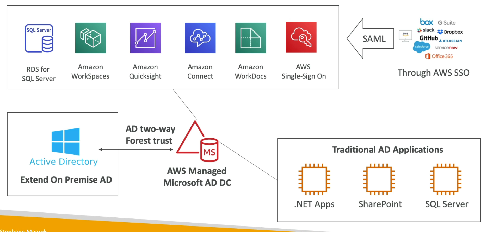
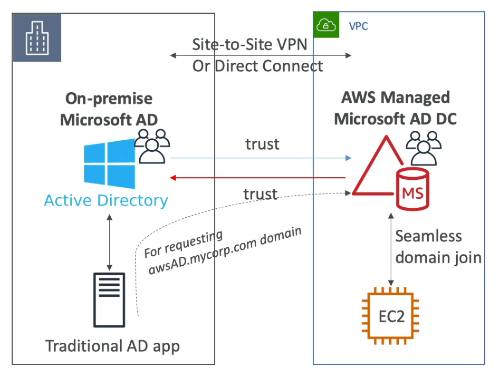
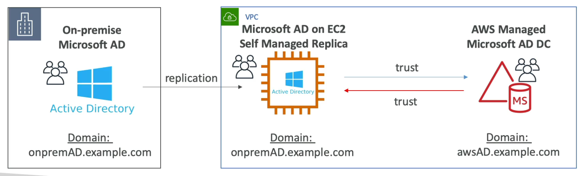
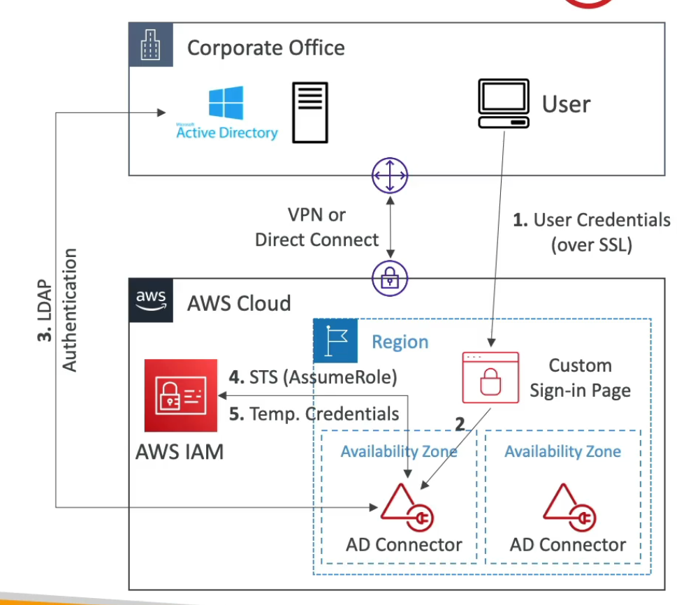

# **AWS Directory Services.**

In the exam, there is a strong preference to test candidates on Microsoft Active Directory & AWS Directory Services.

## **Microsoft Active Directory.**

* Found on any Windows server with AD Domain Services.
* It's a **database of objects** such as user accounts, computers, printers, file shares, security groups etc.
* Allows for centralised security management, creating accounts, assigning permissions.
* Objects are organised into trees.
* A group of trees is called a forest.
* We can synchronise logins across different domain controllers (i.e. machines).

## **ADFS (Active Directory Federation Services).**

* ADFS provides single-sign on across applications.
* SAML integration across 3rd parties (i.e. AWS Console, Dropbox, Office365 etc.).

## **AWS Directory Services.**

* There are 3 different types of directory services & **they are all managed offering from AWS.**
* **AWS Managed Microsoft AD:**
    * Create your own AD in AWS. 
    * Manage users locally.
    * Supports MFA.
    * If you want to create a connection between on-premise ADs, you need to establish a trust relationship.
    * Objects are managed in both places.
* **AWS AD Connector.**
    * Directory gateway (i.e. a proxy) to redirect to on-premises AD's.
    * Supports MFA.
    * Users are managed solely by the on-premise AD.
* **AWS Simple AD.**
    * AD-Compatible managed directory on AWS.
    * Cannot be joined with on-premise ADs.
    * Does not support MFA.
    * Cheaper alternative.

## **Managed Microsoft AD.**

* Deploying a Microsoft AD inside of your VPC.
* We can deploy Windows-based EC2 instances that allow us to run traditional AD applications (such as sharepoint).
* We can also seamlessly join EC2 instances from multiple accounts & VPCs (via. Domain Join feature which is only available through Managed Microsoft AD).
* Has the following integrations:
    * RDS for SQL Server, Workspaces, Quicksight.
    * AWS SSO to provide access to 3rd party applications.
* Is a standalone service in AWS & can be connected to an on-premise AD.
* Multi-AZ deployment of ADs & number of domain controllers can be increased for scaling & high availability.
* Automated backups & multi-region replication of your ADs.

### **Connecting to on-prem ADs (Important).**

* You first must establish a Direct Connect (DX) or VPN connection between your on-premise AD & your AWS Managed Microsoft AD.
* You can set-up 3 kinds of forest trust relationships:
    * One-way trust between AWS & on-premise.
    * One-way trust between on-premise & AWS.
    * Two-way trust between both AWS & on-premise.
* Forest trust is completely different from synchronisation (replication is not supported), we are literally setting up a communication of trust relationship here.
* Users are "living" (i.e. managed) independently from one-another.

## **Active Directory Replication.**

* You may want to create a replica of your on-premise AD on EC2 in the cloud to minimise the latency of AD-communication should a Direct Connect or VPN connection go down.
* Establish trust between your AWS Managed Microsoft AD & EC2.
* You can replicate your on-premise Microsoft AD onto a Windows EC2 machine.

## **Active Directory (AD) Connector.**

* Is a proxy for redirecting requests to your on-premise Microsoft AD.
* No caching capabilities.
* Manage users solely on-premise, no possibility of setting up a trust.
* You must set up a Direct Connect or VPN connection as before.
* Does not work with RDS, doesn't do seamless joining, cannot share directories.

## **Simple AD.**

* Inexpensive AD-compatible service with common / limited directory features.
* Supports joining of EC2 instances, managing users & groups.
* Does not support MFA, RDS, SSO.
* Only for smaller volumes of users (500).
* Powered by Samba4 which is compatible with Microsoft AD.
* No trust relationship is required.