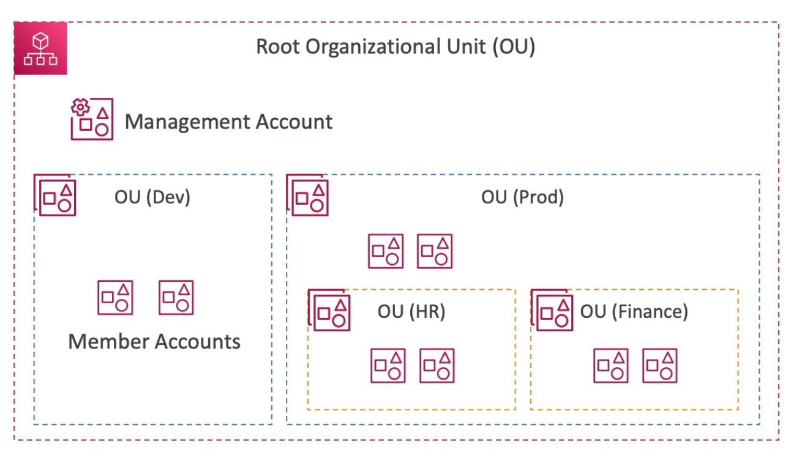
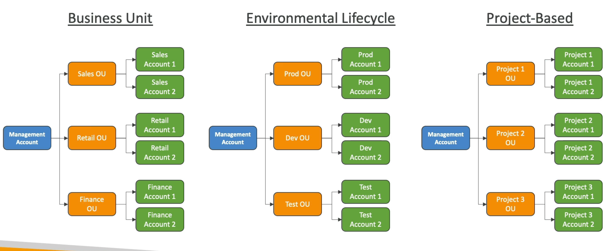

# **AWS Organisations.**

* Manage multiple AWS accounts at any given time.
* Consists of the Management Account & multiple member accounts.
* Organisational accounts are split into organisational units (OU), i.e. dev, prod, root.
* All accounts including the management account sit inside the Root Organisational Unit (ROU).
* You can have further OU's inside an existing OU if you need to, for example inside the "prod" OU you can have a "HR" or "Finance" OU.

## **OrganizationAccountAccessRole.**

* When the management account creates a new member account via. the API, a new IAM role called the OrganizationAccountAccessRole is created within the member account.
* When the management account needs to perform future administrative actions inside the member account, it will assume this role via. the AssumeRole STS API (for example, creating IAM users).
* This role grants full administrative permissions to the management account within the member account.
* This role can be assumed within the member account if a user is authorised to use it, this may be useful for delegating admin tasks to a super-user in the member account for example.
* However, **this role must be created manually if you are inviting an existing member account into your AWS organisation.**

## **Multi-Account Strategies.**

* Below are some examples of common multi-account strategies:
    * Per environment (dev, staging, prod).
    * Per department (HR, Finance, Marketing).
    * Per cost centre.
    * Based on specific regulatory restrictions.
    * For better resource isolation.
    * Logging accounts.
    * To better restrict service limits.
* An alternative solution to multi-account is multi-VPC within one account (although this is generally harder to maintain & not advised).
* It's important to use tagging standards for billing purposes.
* Enable CloudTrail on all accounts & send all of these logs into a centralised S3 bucket or centralised logging account.
* Create an account dedicated to security.
* Below are some visual examples of the above.

## **Feature Modes.**

* Consolidated billing features:
    * Consolidated billing across all accounts (i.e. a single payment method).
    * This gives pricing benefits from aggregated usage (such as volume discounts for EC2 & S3).
* All features (this is the default):
    * Includes consolidated billing feature as well as SCP (service control policy) feature.
    * Invited accounts must approve enabling all features before they can join the organisation.
    * Ability to apply SCPs to prevent member accounts from leaving the organisation.
    * Once you have enabled all features mode you cannot switch back to just consolidated billing.

## **Reserved Instances.**

* For billing purposes, the consolidated billing feature of AWS Organisations treats all the accounts within the organisation as one single account.
* **This means that all accounts inside an organisation can receive the hourly cost benefit of Reserved Instances that are purchased by any other account.**
* The Management Account of an organisation can turn off Reserved Instance & Saving Plan discount sharing for any accounts within the organisation, including the Management Account.
* In this case, the Reserved Instances & Savings Plans are only utilised by the accounts that purchase them.
* In order to share Reserved Instances & Savings Plans across accounts, both accounts must turn sharing on.

## **Moving Accounts.**

You must know the following steps in order to migrate an account from one organisation to another:

1). Remove the member account from the old AWS Organisation.
2). Send an invite to the Member account from the Management account within the new organisation.
3). Accept the invite to the new organisation from the Member account.