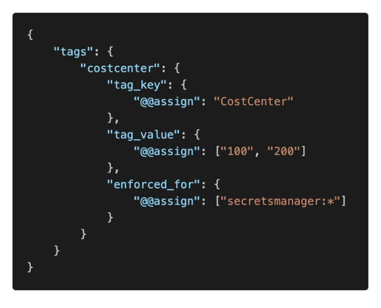
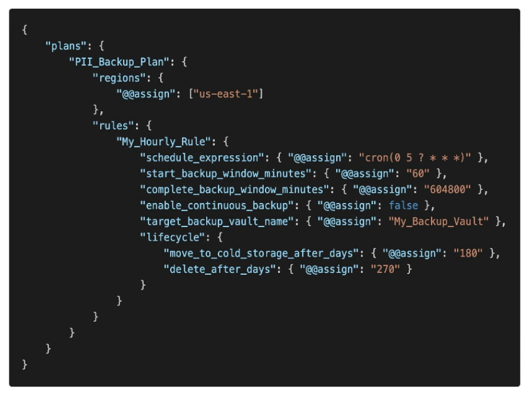

# **Service Controls Policies (SCPs).**

* Used to defined an allowlist or blocklist of IAM actions within an organisation.
* Applied at either an Organisation Unit or Account level.
* Does not apply to the management account.
* **SCPs are applied to all Users & Roles within the account, including the root user.**
* The SCP does not affect any service-lined roles.
    * Service-linked roles enable other AWS services to integrate with AWS Organisations & cannot be restricted by SCPs.
* **SCPs must use an explicit Allow & denies everything by default.**
* Common use cases:
    * Restrict access to certain services.
    * Enforce PCI compliance by explicitly disabling services.

## **SCP Hierarchy.**

* FullAWSAccess SCP is applied to the Root OU.
* SCPs are then applied to OU's or Accounts downwards.
* Below is an example of SCP enforcement within an organisation.

* Management Account:
    * Has full access.
    * Cannot have an SCP applied to it (**even though a DenyAccessAthena SCP has been placed on it, it cannot be enforced**).
* Account A:
    * Cannot use Redshift (**DenyRedshift SCP on the Production OU takes precedence over the account level SCP as it is contained within the OU**).
* Account B:
    * Cannot use Redshift (DenyRedshift SCP inherited).
    * Cannot use Lambda (DenyAWSLambda SCP on the HR OU).
* Account C:
    * Cannot use Redshift (DenyRedshift SCP inherited).
    * Can use Lambda (No SCP enforced on the Finance OU).

**Notice that the SCP that was placed upon the Management account is not enforced & thus not inherited either.**

## **Allowlist & Blocklist.**

* VERY similar to IAM-based strategies on the account level.
* The IAM policy evaluation logic is defined below (although not vital to memorise it's important to be able to understand the hierarchy to know what takes precedence over what for the exam).

* **The evaluation always starts with a scan of all of the following policies for an explicit DENY of the request, if a DENY is found, then the request is explicitly denied before the order of evaluation starts.**
* If no DENY is found, the order of evaluation (for an explicit ALLOW) is as followed:
* Organisational policies (SCPs) > Resource-based policies (S3 buckets, SQS, etc...) > Identity-based policies (IAM roles & policies) > IAM permissions boundaries > Session-based policies.

## **Restricting Tags with IAM Policies.**

* You can restrict specific tags on AWS resources using IAM Policies.
* You can do this using the **aws:Tags** condition key.
    * Validate the TagKeys attached to a resource against the TagKeys IAM policy.
* For example, only **allow** users to create EBS volumes if they specify the "Env" & "CostCenter" tags.
* Use either **ForAllValues** (enforces all keys / tags) or **ForAnyValue** (enforces any of the keys / tags at a minimum).
* This can also be done at the SCP level using explicit denies.

## **Restricting Regions with IAM Policies & SCPs.**

* Similar to the above, we can restrict deployment of resources to specific AWS regions using IAM policies & SCPs.
* Done using the **aws:RequestRegion** condition key.
* You can also bypass SCPs using the **ArnNotLike** condition key, this will allow specific roles to bypass the SCP condition.

## **Tag Policies.**

* Helps you standardise tags across resources in an AWS organisation.
* Ensure consistent tags, audit tagged resources, maintain proper resources categorisation.
* You define tag keys & their allowed values.
* Helps with AWS cost allocation tags & Attribute-based access control.
* Prevent any non-compliant tagging operations on specified services & resources.
* Generate a report that lists all tagged / non-compliant resources.
* Use Amazon EventBridge to monitor non-compliant tags.

_For secrets manager, we can only have the tag "CostCenter" take the value 100 or 200_

## **AI Services Opt-out Policies.**

* Certain AWS AI services may use your content for continuous improvement of Amazon AI/ML services.
* For example, Amazon Lex, Comprehend, Polly etc. all use data to improve their product.
* You can opt-out of having your content stored or used by AWS AI services.
* This is done by creating an opt-out policy that enforces this setting across all member accounts & AWS regions.
* You can opt-out of all services or of specific services.
* Can be attached to your Organisation root, specific organisational units or an individual member account.

## **Backup Policies.**

* AWS Backup enables you to create backup plans that define how to backup your AWS resources.
* Policy documents define backup plans across an AWS organisation.
* Gives you granular control over backing up your resources (e.g. frequency, region, time window).
* Can be attached to your Organisation root, specific organisational units or an individual member account.
* Immutable backup plans appear only in member accounts (are view only).

