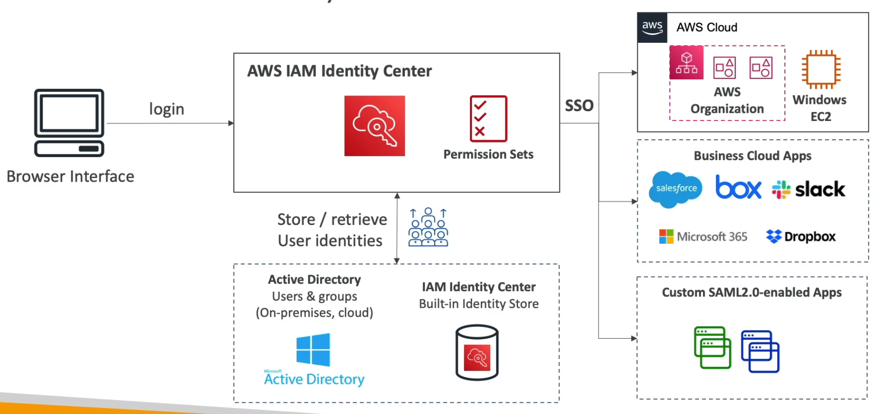
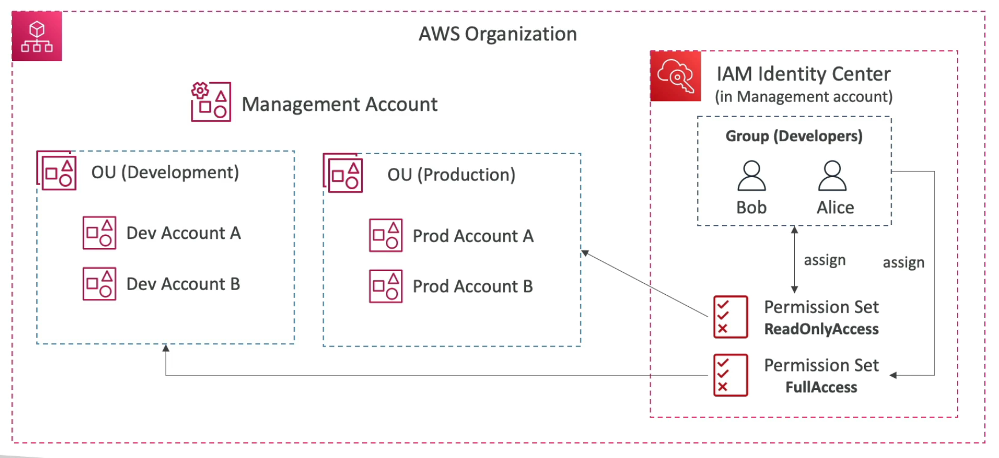

# **IAM Identity Center.**

**This is the successor to AWS Single Sign-on (SSO).**

* One login for all of your:
    * AWS accounts in your AWS organisations.
    * Business applications (e.g. Salesforce, Microsoft 365 apps, Github, etc...).
    * Any SAML 2.0-enabled application.
    * EC2 Windows Instances.
* Identity providers:
    * Built-in identity store in IAM Identity Centre.
    * 3rd party identity providers such as Active Directory (AD), Okta, OneLogin, etc...
* (This is what results in a login portal displaying all accounts when you access the AWS homepage via. Okta at Gousto).
* Permissions sets further restrict specific access within IAM Identity Centre to specific resources.

## **Login Flow.**

## **IAM Identity Centre in AWS Organisations.**

## **Fine-grained Permissions & Assignments.**

* Multi-account permissions:
    * Manage access across AWS accounts in your AWS organisations.
    * Permissions sets are a collection of one or more IAM policies assigned to users & groups that define AWS access.
* Application assignments:
    * Single Sign-On access to many SAML 2.0 business applications.
    * Provides required URLs, certificates & metadata.
* Attribute-based access controls:
    * Fine-grained permissions based on the users' attributes stored in the IAM Identity Center Identity Store.
    * For example, you can assign users to a cost centre, a title or location in Identity Store.
    * You can then define permissions only once & modify attributes assigned to a user in the Identity Store.