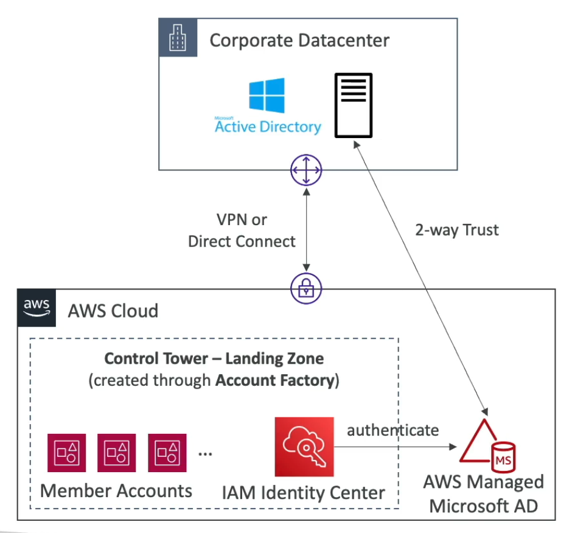
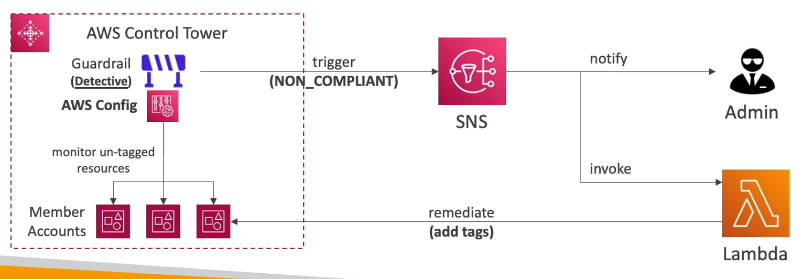

# **Control Tower.**

* Easy way to setup & govern a secure & compliant multi-account AWS environment based on best practices.
* Benefits include:
    * Automated setup of your environments.
    * Automate ongoing policy management using guardrails.
    * Detect policy violations & remediate them.
    * Monitor compliance through an interactive dashboard.
* AWS Control Tower runs on top of AWS Organisations.
    * It automatically sets up AWS Organisations to organise accounts & implement service control policies (SCPs).

## **Account Factory.**

* Automates account provisioning & deployments.
* Enables you to create pre-approved baselines & configure options for the AWS accounts in your organisation (e.g. default VPC configurations, subnets, regions, etc...).
* Uses the AWS Service Catalog (under the hood) to provision new AWS accounts.

## **Guardrails.**

* Provides ongoing governance for your Control Tower environment.
* Is used as a preventative measure, you can use SCPs to help define these preventative measures (e.g. disallow creation of Access Keys for the root user).
* Is also used to a detective measure, you can use Guardrails in conjunction with AWS Config to help detect non-compliance in your Organisation (e.g. detect whether MFA for the root user is enabled).
* Guardrails can trigger SNS topics which in-turn can invoke preventative action using a Lambda function or can directly alert admins.

### **Guardrail Levels.**

* Mandatory:
    * Automatically enabled & enforced by AWS Control Tower.
* Strongly Recommended:
    * Based on AWS best practices (optional).
* Elective:
    * Commonly used by enterprises (optional).