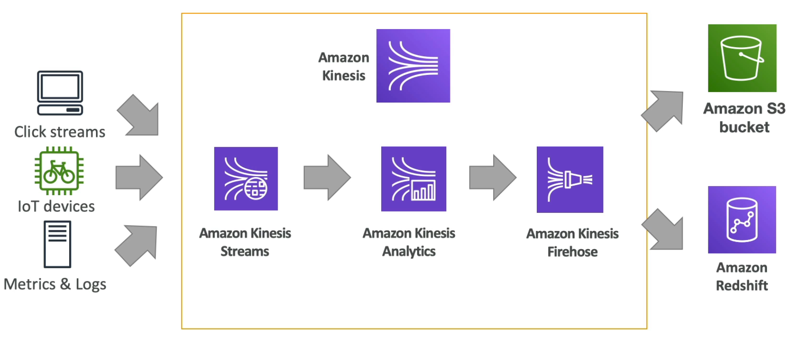

# **Kinesis.**

* Kinesis is managed streaming service that can ingest data from producers in real time.
* Great for application logs, metrics, IoT & clickstream.
* Great integration with big data frameworks such as spark, flink, presto, etc...
* Data is replicated synchronously across (3) availability-zones.
* Kinesis has 3 different product offerings:
    * Kinesis Data Streams - low latency streaming ingest at scale (scaled-down managed Kafka offering - MSK full offering?).
    * Kinesis Analytics - perform real-time analytics on streams using SQL (managed Apache Flink).
    * Kinesis Firehose - load streams of data into S3, Redshift, ElasticSearch & Splunk (scaled-down managed Kafka Connect?).

_H-L example architecture using all 3 Kinesis offerings._
