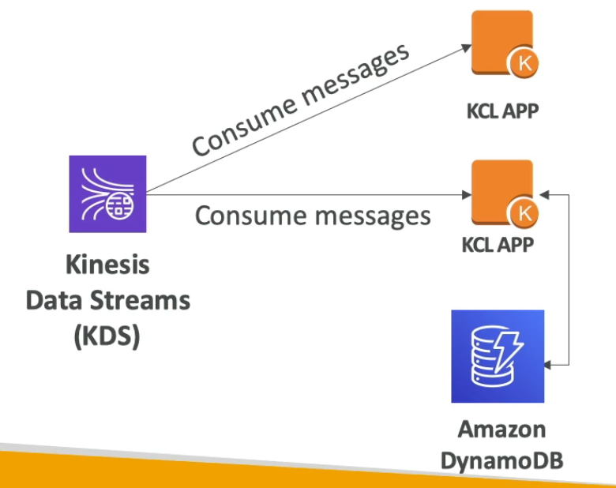

# **Kinesis Data Streams.**

* Streams are divided into shards (similar to partitions).
* Producers produce data to shards & consumers consume data from shards.
* Data retention within each shard is 24 hours by default, can go up to 365 days.
* Ability to reprocess & replay data.
* Multiple applications can consume from the same stream (not possible with SQS due to native delete).
* Gives a pub/sub architecture for streaming data.
* Real-time processing with scale of throughput (more shards = higher throughput & better scalability).
* Data in Kinesis is immutable (it just expires).

## **Shards.**

* Two different modes for capacity:
    * On-demand - no capacity planning & Kinesis will handle scaling automatically.
    * Provisioned - you manage shards (& thus scalability) over time.
* Batching of messages is available or you can process messages 1 at a time (not typically advised).
* Shards can contain more than one partition.
* The number of shards can evolve over time via. a process called resharding (increasing shards) or merging (decreasing shards).
* Records are ordered per shards (think Kafka offsets).

## **Kinesis Producers & Consumers.**

* There are multiple ways a producer can produce data into a shard:
    * AWS SDK - for simple producers.
    * Kinesis Producer Library KPL - for record batching, compression & retries (only compatible with C++ & Java).
    * Kinesis Agent - built atop of the KPL, deployed directly into applications (think EC2) & handles sending of data to shards for you. You can write to both Data Stream & Firehose using the Kinesis agent.
* Data is written to a specific partition within a shard using an appropriate partition key.
* There are multiple ways a consumer can consume data from a shard:
    * AWS SDK - for simple consumers.
    * Lambda - native integration with Kinesis, need to set up event source mapping.
    * Kinesis Consumer/Client Library - checkpointing capabilities & coordinated reads (Databricks' runtime uses this under the hood for sparks' native integration with Kinesis).

_A consumer using the KCL to consume messages from Kinesis & storing checkpoints in DynamoDB (can also use S3 & is what we have used with Databricks_

## **Limits to know.**

* Producer limits:
    * 1 MB/s or 1000 messages per second write per SHARD.
    * To scale write throughput, add shards.
    * If you are trying to send to much data too quickly to a specific shard, you'll get a "ProvisionedThroughputException" error.
* Consumer limits:
    * 2 MB/s read limit per SHARD across ALL consumers.
    * 5 API calls per second per SHARD across ALL consumers.
* A good way to mitigate the above consumer limits is to use a consumer enhanced fan-out architecture.
    * 2 MB/s read limit per SHARD, per consumer.
    * No API calls needed, instead of consumer polling, this method uses a push mechanism.
    * This results in better scale & latency.
* Data retention:
    * 24 hours by default.
    * Can be extended to 365 days if required.