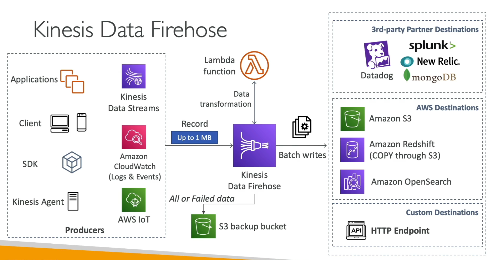
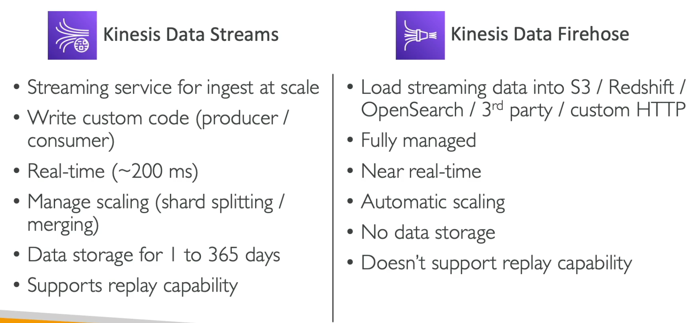

# **Kinesis Data Firehose.**

* Kinesis Data Firehose is used to push data from a source into a sink.
* You can also run a Lambda function on top of Firehose to transform data if you want to.
* **Firehose is a useful buffering mechanism that can batch & compress data from source into the destination.**
    * You can set a buffer interval between 0-900 seconds.
    * You can also set a buffer size (minimum of 1 MB per payload).
* This makes the service **near real-time**.
* **From a Data Engineering perspective, this is extremely useful for things like table restates of raw data (less small files for something like Spark to read).**
* Supports many data formats, conversations & transformations.
* Firehose is a managed, low-code / code-free solution.
* Administration, scaling (it's serverless) & maintenance is all handled for you.
* Only pay for the data that is going through Firehose.
* Possible sources for Firehose include:
    * Applications & clients - web & mobile apps (using the SDK or producer library).
    * Kinesis Data Streams.
    * Cloudwatch events & logs.
    * AWS IoT.
* Possible sinks for Firehose include:
    * AWS destinations - S3, Redshift (write to S3 & issues a COPY command), OpenSearch - **you must know these 3 for the exam.**
    * 3rd-party destinations - Datadog, Splunk, MongoDB.
    * Custom sinks - APIs & HTTP endpoints.
* Data can also be backed up in an S3 bucket (either all or just failed).

## **Firehose Buffer Sizing.**

* Firehose accumulates records into a buffer.
* The buffer is flushed depending on the buffer time or size, whichever limit is met first.
* If the buffer size (e.g. 32MB) is met first, flush the buffer to the sink, if the buffer time (e.g. 60 seconds) is met first, flush the buffer to the sink.
* You **must** set both buffer time & size limits.
* Firehose can automatically increase the buffer size to increase throughput if needed.
* High throughput (more data) = buffer size is hit, low throughput = buffer time is hit.
* **If real-time flush from Kinesis Data Stream to S3 (or any other sink) is needed, use Lambda instead of Firehose.**

## **Kinesis Data Streams vs Kinesis Data Firehose.**

