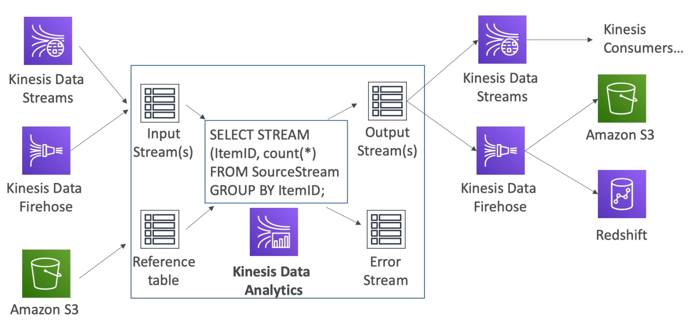

# **Kinesis Data Analytics.**

* Built atop Apache Flink.
* Used for real-time streaming analytics.
* Kinesis Data Analytics can read from Data Streams or Firehose.
* Data can be written to a series of sinks such as other analytics tools or applications.
* Used for on-the-fly lookups & joins, usually using some form of static reference table.
* Data is queried & processed using SQL.
* Data is then written out to output streams & into sinks.
* There is also the concept of error streams which can also be written out to sinks (i.e. to S3).
* Common sinks are other streaming services such as Data Streams, Firehose, Kafka, etc...

## **Use Cases.**

* Streaming ETL - select columns & make simple transformations on streaming data.
* Continuous metric generation - for example a live leaderboard for a mobile game.
* Responsive analytics for alerting & filtering (maybe something like fraud detection).

## **Features.**

* Pay only for the resources used (not necessarily cheap).
* Serverless so scales automatically.
* Use IAM permissions to access streaming sources & destinations.
* Can write application code in either SQL or Java (Flink).
* Supports schema discovery.
* Lambda can be used for pre-processing.