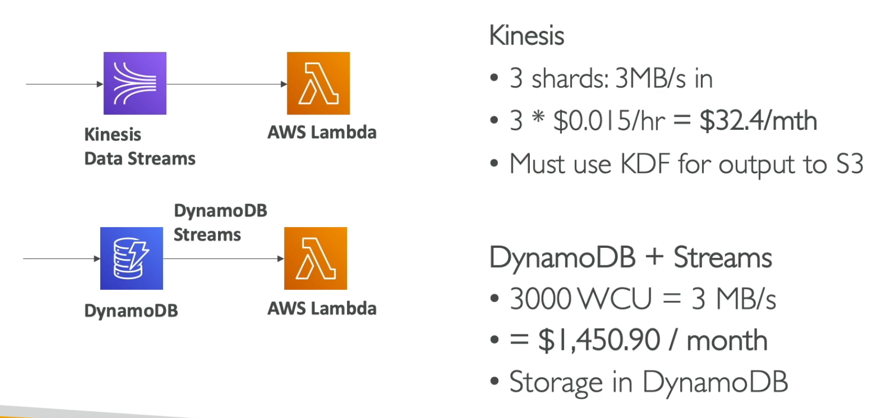

# **Streaming Architectures.**

Below are some common real-time streaming architectures utilising AWS components.

## **Basic.**

## **Cost Effective Architecture.**

* We have an application that produces 3000 messages at 1 KB per second.
* We can choose to either use Kinesis Data Streams with Lambda, or DynamoDB streams with Lambda.
* We can output data into S3 using something like Firehose.
* How might you go about deciphering which architecture is best?

_WCU = Write Capacity Units._

_The take-home here is that, although both solutions work, the streaming specific solution architecture & streaming offerings from AWS tend to be the cheapest for the given use-case._
