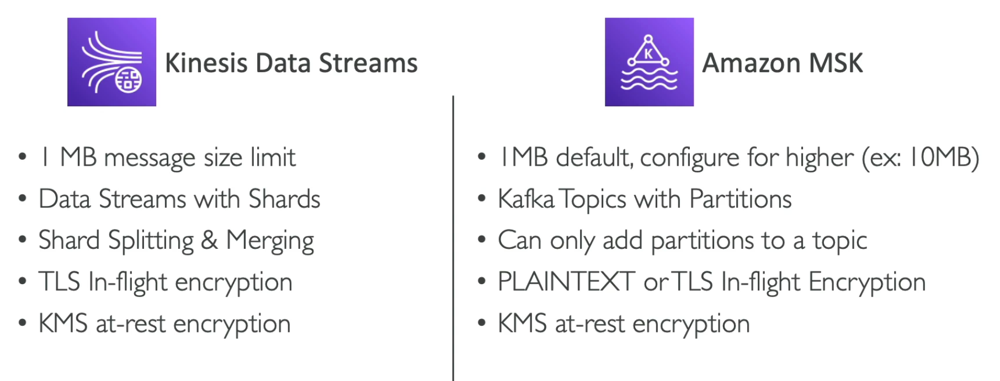

# **MSK.**

* Alternative to Kinesis.
* Managed Kafka offering.
    * Allows you to create, update & delete clusters.
    * Creates & manages Kafka brokers & zookeeper nodes for you.
    * Deploys the MSK cluster in your VPC & across multiple availability zones.
    * Automatic recovery from common Kafka failures.
    * Data is stored on EBS volumes for as long as you want.
* There is also an MSK serverless offering.
    * Run Kafka on MSK without managing any capacity.
    * MSK provisions resources & scales compute for you.
* MSK uses slightly different terminology to Kinesis Data Streams in that it uses topics & partitions rather than shards with partitions.
* The default size limit per topic in MSK is 1 MB (limit for Kinesis) & can be configured as high as 10 MB.

## **Kinesis Data Streams & MSK.**

Find below the key differences between Kinesis & MSK (from an exam perspective).

## **MSK Producers & Consumers.**

* You can produce to MSK in a multitude of different ways (very similar to how you would for Kinesis Data Streams).
* Some common AWS offerings that can act as a consumer include:
    * Kinesis Data Analytics (Flink).
    * Glue (Spark Structured Streaming).
    * Lambda.
    * Custom applications running on EC2.
    * Custom applications running on ECS.