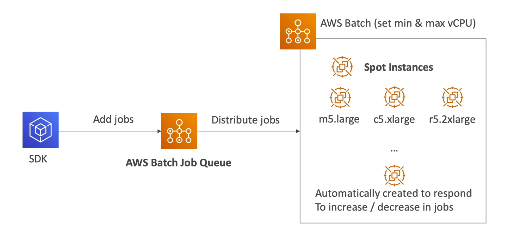

# **AWS Batch.**

* Run batch jobs as Docker images.
* You have 2 options to run batch jobs on AWS:
    * Run jobs as serverless jobs on Fargate.
    * Run jobs using dedicated / dynamic infrastructure (such as EC2 & Spot Instances) inside a VPC.
* Choose the optimal quantity & type based on volume & requirements.
* No need to managed clusters on Fargate, so is classed as a fully-managed, serverless offering.
* You pay for the underlying resources that are used.
* Use cases:
    * Batch processing of images.
    * Running hundreds of concurrent jobs.
    * Any form of batch workload.
* You can schedule batch jobs using EventBridge using a CRON schedule.
* Orchestrate batch jobs using AWS Step Functions.

## **Example Solution Architecture.**

## **Batch vs Lambda.**

* Lambda:
    * Time limit (max 900 seconds).
    * Limited runtimes.
    * Limited temporary disk space.
    * Serverless.
* Batch:
    * No time limit.
    * Any runtime is supported as long as it's used as a Docker image.
    * Uses ephemeral storage (EBS) for disk space.
    * Can be serverless if used with Fargate, otherwise isn't.

## **Batch Compute Environments.**

* There are different types of compute environments that AWS batch offers:
* **Managed Compute Environment:**
    * Batch manages the capacity & instance types within the environment.
    * For dedicated infrastructure you can use either on-demand or spot instances.
    * As always, you can set a maximum price for spot instances.
    * Launched within your own VPC.
        * Make sure that if launched within your own private subnet, there is a NAT gateway or VPC endpoint so that Batch can access ECS.
* **Unmanaged Compute Environment:**
    * You control & manage the instance configuration, provisioning & scaling.

### **Managed Compute Architecture.**

## **Multi-Node Mode.**

* Typically 1 batch job = 1 node, however, you can set up a multi-node environment.
* Good for high performance computing & large scale processing.
* Leverages multiple EC2 or ECS instances at the same time.
* Good for tightly coupled workloads.
* Represents a single job, you specify how many nodes to create for the job.
* 1 driver / main node that manages & orchestrates child nodes.
* **Does not work with spot instances.**
* Works better if your EC2 launch mode is a placement group cluster - results in hardware being on the same rack in the same AZ (better networking).